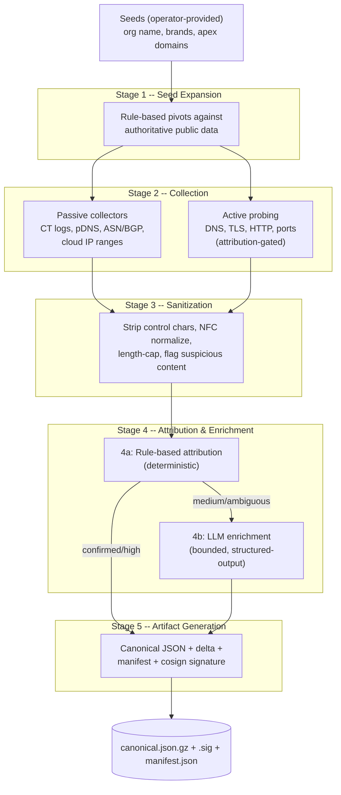
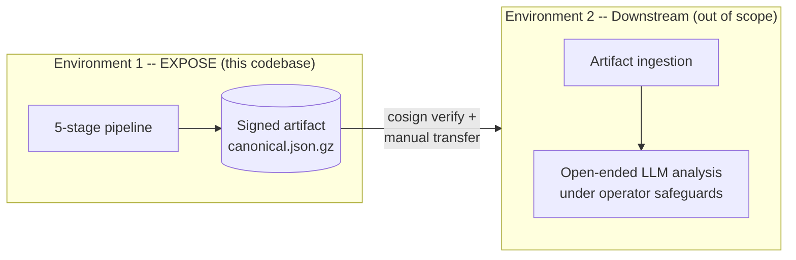

# EXPOSE

**Continuous external attack surface intelligence with signed, attributed artifacts.**

[](LICENSE)
[](https://www.python.org/)
[](#project-status)
[](#project-status)

EXPOSE is an open-source External Attack Surface Intelligence (EASI) platform that discovers, attributes, and continuously monitors an organization's internet-facing surface. It produces cryptographically signed JSON artifacts with full provenance chains -- every claim traceable to the collector, observation, and rule that justified it. Built for both defensive CTEM workflows and authorized red team operations, EXPOSE is self-hostable and designed to run inside your own authorization boundary.

---

## Key Differentiators

- **Signed Artifacts** -- Every artifact is cosign-signed with SLSA-aligned provenance attestations and FIPS SHA-256 hashing. Downstream consumers verify integrity offline. No other EASM tool in the commercial or open-source landscape produces tamper-evident, cryptographically signed deliverables.

- **Transparent LLM Enrichment** -- Four provider adapters (Anthropic, OpenAI, Gemini, Ollama) behind a SafeLLMClient that enforces structured-output schemas, per-run cost ceilings, prompt-injection defenses, and per-call audit logging. The operator controls which provider runs, what it costs, and what it is allowed to produce. The LLM never invents observations -- it reasons over the graph.

- **Attribution Rigor** -- Confidence tiers (`confirmed`, `high`, `medium`, `requires_review`) with numeric scores and full evidence chains. Declarative rule packs define attribution logic as data, not code. Every finding carries the ATT&CK technique IDs that contributed to its attribution.

- **Federal-Ready Open Core** -- Apache 2.0 engine with FedRAMP-ready architecture. FIPS 140-3 validated cryptography, NIST 800-53 control alignment, AU-family audit logging. Federal agencies self-host within their own ATO boundary and integrate artifacts into continuous monitoring.

---

## Architecture

EXPOSE executes a five-stage pipeline per run. Four stages are fully deterministic; LLM enrichment in Stage 4b is bounded by SafeLLMClient and produces only structured outputs validated against a schema.



---

## Collector Matrix

14 built-in collectors across three sensitivity tiers. Tier 3 (active) collectors are attribution-gated: they only execute against entities with `confirmed` or `high` attribution, or explicit authorization scope membership.

| Collector | ID | Tier | Source | Credentials | Status |
|---|---|---|---|---|---|
| crt.sh CT Logs | `ct-crtsh` | T1 Passive | Certificate Transparency via crt.sh | None | Built |
| Certstream CT | `ct-certstream` | T1 Passive | Near-real-time CT log stream | None | Built |
| RDAP / WHOIS | `rdap-whois` | T1 Passive | RDAP bootstrap + WHOIS fallback | None | Built |
| Cloud IP Ranges | `cloud-ranges` | T1 Passive | AWS, Azure, GCP published manifests | None | Built |
| BGP (HE Toolkit) | `bgp-he-toolkit` | T1 Passive | Hurricane Electric BGP Toolkit | None | Built |
| BGP (RIPEstat) | `bgp-ripestat` | T1 Passive | RIPEstat Data API | None | Built |
| BGP (Team Cymru) | `bgp-team-cymru` | T1 Passive | Team Cymru DNS service | None | Built |
| SPF/DKIM/DMARC | `spf-dkim-dmarc` | T1 Passive | DNS TXT record queries | None | Built |
| GitHub Exposed | `github-exposed` | T1 Passive | GitHub Search API | GitHub PAT | Built |
| Favicon Hash | `favicon-hash` | T2 Passive | HTTP favicon fetch + MurmurHash3 | None | Built |
| Active DNS | `active-dns-resolve` | T3 Active | Direct DNS resolution | None | Built |
| Active TLS | `active-tls-handshake` | T3 Active | TLS handshake + JARM fingerprint | None | Built |
| Active HTTP | `active-http-fingerprint` | T3 Active | HTTP headers + response fingerprinting | None | Built |
| Active Port Surface | `active-port-surface` | T3 Active | TCP connect scan (curated port set) | None | Built |

---

## Quick Start

```bash
# Install
pip install expose-easi

# Run a basic discovery against your own domain
expose run --seed-domain example.com --collectors ct-crtsh,active-dns-resolve

# Run with multiple passive collectors
expose run --seed-domain example.com \
  --collectors ct-crtsh,rdap-whois,cloud-ranges,bgp-ripestat

# Start the web dashboard
expose serve --port 8000

# Verify a produced artifact
cosign verify-blob --key cosign.pub \
  --signature canonical.json.gz.sig canonical.json.gz
```

For full deployment with Helm:

```bash
git clone https://github.com/pitt-street-labs/expose.git
cd expose

# Deploy to Kubernetes
helm install expose ./deploy/helm-chart \
  --namespace expose --create-namespace \
  --values your-tenant-config.yaml
```

See [`CONTRIBUTING.md`](CONTRIBUTING.md) for development setup with `uv`, pre-commit hooks, and the full test suite.

---

## Two-Environment Model

EXPOSE is **Environment 1** -- a deterministic discovery and enrichment engine that produces signed JSON artifacts. **Environment 2** is a separate, downstream system where open-ended LLM-driven analysis (narrative reasoning, exploit hypothesis generation, red team briefing prose) happens under the operator's own safeguards. This separation keeps Environment 1's safety properties simple to audit and prevents the engine from producing unverifiable claims.



Artifacts cross from E1 to E2 via manual transfer with signature verification. No direct system-to-system connection exists by design.

---

## Who Is This For?

**Red Team Operators.** EXPOSE replaces days of manual Censys, passive DNS, and WHOIS correlation with a pipeline that produces a signed scope-confirmation artifact in hours. Confidence tiers and evidence chains let you defend attribution decisions in client review. The same engine your client's defensive team uses, so both sides speak the same language about the attack surface.

**Security Directors and CISOs.** Self-host the open-source engine inside your authorization boundary at zero software cost. Signed artifacts with AU-family audit logging feed directly into your SIEM and continuous monitoring evidence. Multi-tenant architecture lets you monitor subsidiaries, acquisitions, and third parties with per-tenant quota enforcement and GDPR/CCPA-compliant data export and deletion.

**Threat Researchers.** Apache 2.0 licensing, reproducible deterministic artifact generation, and full provenance chains make EXPOSE the first EASM tool you can publish a methodology paper on. Run locally with Ollama for cost discipline. The EXPOSE Research dataset offering (CC BY 4.0) provides reference graphs and schemas for benchmarking and academic work.

---

## Documentation

| Document | Description |
|---|---|
| [`docs/SPEC.md`](docs/SPEC.md) | Full specification -- architecture, threat model, observation graph, collectors, attribution engine, LLM integration, artifact format |
| [`docs/adr/`](docs/adr/) | 10 Architecture Decision Records covering the foundational design |
| [`docs/positioning.md`](docs/positioning.md) | Strategic positioning and competitive analysis |
| [`docs/architecture/`](docs/architecture/) | Mermaid diagrams -- pipeline, two-environment model, deployment topology, observation graph, multi-tenancy, scanner egress, attribution flow, product surfaces, federal deployment |
| [`docs/glossary.md`](docs/glossary.md) | Term definitions |
| [`docs/strategy/`](docs/strategy/) | Advisory strategy documents -- persona analysis, competitive analysis, framework annotation, SDLP, federal deployment guide |
| [`schemas/`](schemas/) | JSON Schema (Draft 2020-12) -- canonical artifact, manifest, rule pack |
| [`examples/rulepacks/`](examples/rulepacks/) | Example rule packs (baseline, cloud-first, conservative) |
| [`ETHICS.md`](ETHICS.md) | Intended use, non-goals, ethics posture |
| [`SECURITY.md`](SECURITY.md) | Security disclosure policy |
| [`CONTRIBUTING.md`](CONTRIBUTING.md) | Contribution guidelines (DCO required) |
| [`CODE_OF_CONDUCT.md`](CODE_OF_CONDUCT.md) | Contributor Covenant 2.1 |

---

## Project Status

**Pre-release.** The specification is complete and locked. Phase 1 implementation is active.

| Metric | Value |
|---|---|
| Python source files | 111 across 18 sub-packages |
| Test files | 61 |
| Tests passing | 1,059 |
| Collectors built | 14 (9 passive T1, 1 targeted T2, 4 active T3) |
| LLM provider adapters | 4 (Anthropic, OpenAI, Gemini, Ollama) |
| Architecture decisions | 10 ADRs |
| JSON schemas | 3 (canonical artifact, manifest, rule pack) |

The engine, pipeline, collectors, LLM integration, multi-tenant API, compliance subsystem, and observability stack are implemented and tested. This is not yet recommended for production use -- expect breaking changes to configuration and schema formats before v1 GA.

---

## Contributing

Contributions are welcome. See [`CONTRIBUTING.md`](CONTRIBUTING.md) for guidelines, development setup, and the full testing workflow.

All commits require [Developer Certificate of Origin](https://developercertificate.org/) sign-off (`Signed-off-by:` line), enforced by DCO bot. Pre-commit hooks handle linting (ruff), secret scanning (gitleaks), schema validation, and Helm chart linting.

---

## License

[Apache License 2.0](LICENSE).

The engine is open source. Commercial modules (Threat Context, Identity Surface) are licensed separately. See [`docs/positioning.md`](docs/positioning.md) for the product structure.

---

## Security

To report a vulnerability, see [`SECURITY.md`](SECURITY.md).

---

## Maintainers

[Pitt Street Labs](https://pittstreetlabs.com)
