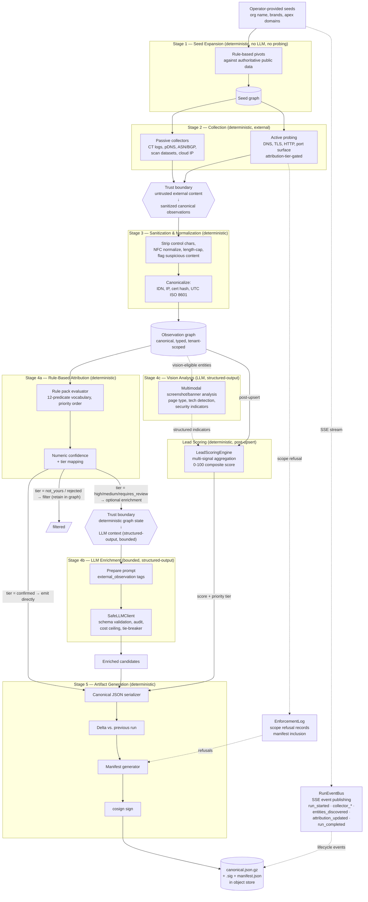

# 00 — Pipeline stages

**What this shows.** The five-stage Environment 1 pipeline that produces the canonical signed JSON artifact, per SPEC §2.2. Each stage is annotated as deterministic or LLM-bearing. The two trust boundaries — between stages 2 and 3 (untrusted external content → sanitized canonical observations) and between stages 4a and 4b (deterministic graph state → LLM context) — are drawn explicitly because they shape the pipeline's safety properties.

This is the highest-level operational view of EXPOSE Core. Everything else in this directory is a closer look at one piece of this picture.

## Diagram

## What each stage does, briefly

**Stage 1 — Seed Expansion.** Deterministic. No LLM, no external probing. Operator-provided seeds (org name, brand strings, known apex domains, cloud account IDs) are expanded into a candidate seed graph using rule-based pivots against authoritative public data. The output is the input to Stage 2.

**Stage 2 — Collection.** Deterministic. Two parallel tracks. Passive collectors query Certificate Transparency logs, passive DNS providers, ASN/BGP data, internet-wide scan datasets, and cloud-provider IP-range manifests. Active probing executes DNS resolution, TLS handshakes, HTTP fingerprinting, and light port-surface enumeration — but only against entities whose attribution tier is `confirmed` or `high`, or which are explicitly in the tenant authorization scope. This gating is enforced at the collector dispatch layer per SPEC §6.3.

**Trust boundary (2 → 3).** Cert SAN values, HTTP banners, DNS TXT contents, WHOIS organization fields, and redirect targets are operator-influenced data. Adversaries plant content there to manipulate downstream tooling. Stage 3 enforces that no raw external content reaches stages 4 and 5 without canonicalization.

**Stage 3 — Sanitization & Normalization.** Deterministic. Strips ASCII control characters except `\t \n \r`, normalizes Unicode to NFC, length-caps fields per SPEC §7.1, flags suspicious content (HTML in plain-text fields, embedded JSON, very long strings, base64 blobs). Then canonicalizes — domain names lowercased and IDN-normalized, IP addresses to canonical representation, cert fingerprints from PEM to lowercase hex, timestamps to UTC ISO 8601. Canonicalization is idempotent.

**Stage 4a — Rule-Based Attribution.** Deterministic. The configured rule pack is applied to each candidate target via a closed, versioned 12-predicate vocabulary. Rules fire in priority order, contributing positive (promote), negative (demote), or zero (informational) deltas to the target's numeric confidence. Seed entities receive `confirmed` / 1.0 attribution automatically (SPEC section 6.3). After all rules evaluate, the resulting numeric confidence maps to an attribution tier (`confirmed`, `high`, `medium`, `requires_review`, `not_yours`, `rejected`) via the rule pack's thresholds. `confirmed` targets are emitted directly to Stage 5; `not_yours` and `rejected` are filtered. Tier-3 collector dispatch is gated on attribution outcome — only entities with sufficient attribution tier are eligible for active probing. Dispatch refusals are recorded in the `EnforcementLog` for manifest inclusion.

**Trust boundary (4a → 4b).** The LLM enrichment pass receives strictly structured input. Sanitized observation excerpts are wrapped in `<external_observation>` tags with system-prompt instructions to treat enclosed content as data, never as instructions. SafeLLMClient validates that this discipline is preserved per call.

**Stage 4b — LLM Enrichment.** LLM-bearing but bounded. Targets with tier `high`, `medium`, or `requires_review` may go through enrichment depending on configuration. The LLM performs bounded, structured-output tasks: attribution sanity-check, tech-stack inference, noise classification. The LLM never invents observations; output schema validation rejects malformed responses. SafeLLMClient enforces sanitization integrity, schema validation, per-call audit logging, per-run cost ceiling (default $5 USD), and optional tie-breaker escalation. Lead-narrative generation is explicitly out of scope for v1 in Environment 1.

**Stage 4c — Vision Analysis.** LLM-bearing, structured-output. Captured screenshots and text banners are analyzed using multimodal LLM capabilities to identify login portals, default pages, technology indicators, and security misconfigurations that header analysis alone cannot detect. Output is validated against Pydantic schemas (`ScreenshotAnalysis`). Detected security indicators (default credentials hints, version disclosure, debug mode, admin panels) feed into lead scoring. Per ADR-005, the LLM never invents observations — it reasons over captured visual/textual data only.

**Lead Scoring.** Deterministic, post-upsert. After entities are upserted to the observation graph, the `LeadScoringEngine` aggregates multiple signal types — environment classification, WAF detection, DNSBL listings, trust degradation events, SaaS alignment gaps, vision analysis findings, and observation-level security indicators — into a composite 0-100 score per entity. The score maps to a priority tier (critical 70-100, high 40-69, medium 20-39, low 0-19) and answers "what should I investigate first?" Same formula version plus same inputs produces the same score (deterministic, auditable).

**Enforcement Logging.** Deterministic. When the dispatcher denies a Tier-3 dispatch — because an entity lacks sufficient attribution or is not in the tenant's explicit authorization scope — a `ScopeRefusalEvent` is recorded in the `EnforcementLog`. Refusal events carry tenant, entity, collector, reason, enforcement mode (hard/warn), and timestamp. The log is serialized into the run manifest so downstream consumers have visibility into what was not collected and why.

**SSE Event Publishing.** The `RunEventBus` publishes typed lifecycle events (`run_started`, `collector_started`, `collector_completed`, `collector_failed`, `entities_discovered`, `attribution_updated`, `run_completed`) via Server-Sent Events. The HTMX-based dashboard subscribes to `GET /v1/tenants/{tenant_id}/runs/{run_id}/events` for real-time graph and table animation during active pipeline runs. The bus uses per-subscriber `asyncio.Queue` instances keyed by `run_id`; connections auto-close on `run_completed` or client disconnect.

**Stage 5 — Artifact Generation.** Deterministic. Serialize the attributed targets into the canonical JSON file (gzipped, indented, conforming to `schemas/canonical-artifact-v1.json`). Compute the delta from the previous run. Generate the manifest (small, quickly inspectable, references the canonical file's hash, includes enforcement refusal summary). Sign the canonical file with cosign — keyless via GitHub Actions OIDC for production deployments, or operator-controlled keypair for lab. Write to the configured object store. The deliverable is `runs/{tenant_id}/{run_id}/canonical.json.gz` plus `.sig` and `manifest.json`.

## Deterministic vs. LLM stages at a glance

| Stage | Deterministic? | LLM? | Notes |
|---|---|---|---|
| 1 — Seed Expansion | Yes | No | Pure pivots against public data |
| 2 — Collection | Yes | No | External APIs and probing; gating enforced |
| 3 — Sanitization | Yes | No | Idempotent; defends Stage 4 |
| 4a — Rule-Based Attribution | Yes | No | 12-predicate rule pack; seeds auto-confirmed |
| 4b — LLM Enrichment | Bounded | **Yes** | SafeLLMClient-wrapped; structured-output only |
| 4c — Vision Analysis | Bounded | **Yes** | Multimodal screenshot/banner; structured-output |
| Lead Scoring | Yes | No | Post-upsert; multi-signal 0-100 composite |
| Enforcement Logging | Yes | No | Scope refusal audit trail; manifest inclusion |
| SSE Events | Yes | No | Real-time lifecycle events via RunEventBus |
| 5 — Artifact Generation | Yes | No | cosign-signed, deterministic given same inputs |

The asymmetry is deliberate. The core pipeline stages are deterministic, and the two LLM stages (4b enrichment, 4c vision) are bounded by the SafeLLMClient discipline so their behavior cannot leak past the structured outputs the pipeline expects. Lead scoring, enforcement logging, and SSE event publishing are all deterministic supporting stages. This is the architectural property that lets EXPOSE produce signed artifacts with confidence that the LLM did not inject unverified claims.

## What this diagram intentionally omits

- The work queue between control plane and workers (see diagram 20 for the deployment topology).
- Per-collector implementation details, rate limiting, partial-run semantics (see SPEC §6.5).
- The 12 predicate implementations (see `src/expose/pipeline/rule_evaluator.py` and `schemas/rulepack-v1.json`).
- Per-LLM-provider interaction details (see SPEC §8.4 and diagram 60).
- The Environment 1 → Environment 2 handoff (see diagram 10).

## References

- SPEC.md §2.2 — Pipeline stages
- SPEC.md §3 — Threat model (trust boundaries 2→3 and 4a→4b)
- SPEC.md §6.3 — Collector tiers and gating (Tier 3 attribution-gated)
- SPEC.md §7 — Sanitization and normalization
- SPEC.md §8 — Attribution and enrichment
- SPEC.md §9 — Artifact generation
- ADR-005 — LLM integration (multi-provider with SafeLLMClient)
