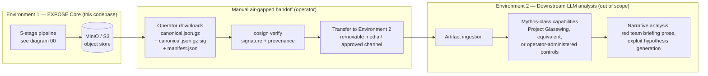
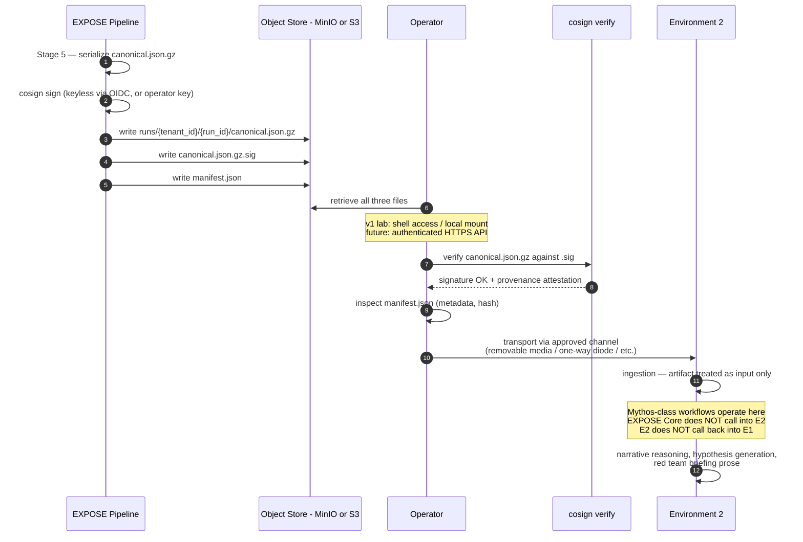

# 10 — Two-environment model

**What this shows.** The manual air-gapped handoff from Environment 1 (the EXPOSE deterministic discovery and enrichment pipeline this codebase defines) to Environment 2 (a separate operational environment where downstream LLM-driven analysis happens). Environment 2 may use Mythos-class capabilities under appropriate safeguards; EXPOSE neither calls nor depends on those capabilities. The boundary is enforced by the operator transferring a signed artifact across it, not by any direct system-to-system connection.

This separation is one of EXPOSE's defining architectural commitments. It preserves air-gap discipline appropriate for high-capability autonomous LLM tooling, keeps Environment 1's safety properties simple to audit, and isolates the domains of concern: Environment 1 is "what is reachable that belongs to us"; Environment 2 is "what does an operator do about it."

## High-level flow

## Sequence view — the handoff in detail

## Why the separation matters

The two-environment model is a deliberate choice with three consequences:

**Auditability.** Environment 1's safety properties — deterministic generation, bounded LLM enrichment, structured-output discipline, no general tool access for the LLM — are simple to audit. Adding open-ended LLM workflows directly to Environment 1 would expand the safety surface significantly. By keeping that capability in Environment 2 across an air-gap, the rigor of Environment 1's audit is preserved.

**Operational containment.** Mythos-class capabilities and Project-Glasswing-equivalent tools may be subject to access restrictions, dedicated-deployment requirements, or operator-administered safeguards that EXPOSE Core, as Apache 2.0 open source, cannot inherit. The handoff boundary lets each environment operate under its own governance.

**Threat model containment.** A compromise of Environment 2's high-capability tooling does not, by construction, give an attacker the ability to influence Environment 1's discovery substrate. The artifact is one-way; Environment 1 has no listening port that Environment 2 talks back to.

## What the artifact carries across the boundary

Per SPEC §9 and `schemas/canonical-artifact-v1.json`, the canonical artifact contains:

- Per-target records with `target_id` (deterministic from primary identifier — same target across runs gets the same ID).
- Attribution tier (`confirmed`, `high`, `medium`, `requires_review`) and numeric confidence.
- Lead score with full input weights and matched modifiers (auditable formula version).
- Full provenance — every claim references the collector, observation, and rule that produced it.
- ATT&CK technique IDs that contributed to attribution decisions (per positioning.md §2.1).
- `delta_from_previous_run` section with `added` / `removed` / `changed` classifications and structured removal reasons (`no_longer_observed`, `removal_uncertain_collector_failure`, `analyst_rejected`, `attribution_downgraded_below_threshold`, `scope_changed_now_outside`, `tenant_data_subject_request`).
- `collector_health` — which collectors succeeded, failed, or were rate-limited.
- `tenant_id`, `run_id`, formula and rule-pack versions, generation timestamp.

The manifest carries hash, size, formula version, run metadata, and a pointer to the canonical file. It is small and quickly inspectable; a reviewer can see what kind of run produced what kind of output without expanding the gzipped JSON.

## Signature verification on the consumer side

Per SPEC §9.4 and SECURITY.md (engine repo):

- v1 production: cosign keyless signing via GitHub Actions OIDC. Verification uses transparency-log entries (Rekor) and the published certificate identity.
- Lab: cosign keypair signing. Verification uses the operator-controlled public key.
- Unsigned mode: only available with explicit configuration and noted in the manifest as unsigned. Environment 2 should refuse to ingest unsigned artifacts in production posture.

The verification step is non-optional in the recommended workflow. If `cosign verify` fails, Environment 2 should treat the artifact as compromised and not ingest it.

## What Environment 2 does (out of scope here)

Environment 2 is explicitly out of scope for this specification, but a brief sketch helps reviewers understand the boundary:

- Ingests the canonical artifact as structured input.
- Reasons over the leads using whatever LLM tooling and human review the operator has configured.
- Produces narrative outputs — red team briefing prose, exploit hypothesis generation, lead prioritization narratives, analyst summaries — that EXPOSE Core deliberately does not produce in v1.
- May use Mythos-class capabilities (autonomous LLM agents with broader tool access) under operator-administered controls, Project Glasswing access, or equivalent program safeguards.
- Does not write back into Environment 1. Any feedback loop (e.g., analyst-flagged false positives) re-enters Environment 1 through operator action — manual rule pack updates, scope adjustments, configuration changes — not via direct connection.

## What this diagram intentionally omits

- The internal structure of Environment 2 (out of scope by design).
- The transport mechanism for the handoff (this is operator-policy: removable media, one-way diode, approved file-transfer service — the architecture is silent).
- The specific Mythos-class capabilities or Project Glasswing access patterns (governance lives outside this codebase).
- Any direct E1 ↔ E2 connection. There is none. That is the point.

## References

- SPEC.md §2.1 — The two-environment model
- SPEC.md §1.2 — Non-goals (open-ended narrative reasoning, exploit hypothesis generation, real-time streaming, live API in v1)
- SPEC.md §9.4 — Signing
- SPEC.md §9.5 — Storage and delivery
- ADR-004 — Output artifact (signed JSON file as sole deliverable)
- positioning.md §1.1 — "Designed to produce structured input for downstream high-capability AI security analysis"
