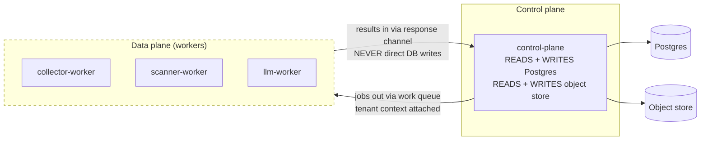

# 20 — Deployment topology

**What this shows.** The container topology of EXPOSE Core per SPEC §4.1 and ADR-003. The deployment is OCI-image-based, distributed via Helm chart, target-agnostic. v1 lab runs on ARC at Pitt Street Labs (k3s, MinIO, Vaultwarden, self-managed Postgres); the same artifacts deploy to AWS / Azure / GCP / customer on-prem with different values files.

The diagram also draws the **data plane / control plane separation** described in SPEC §4.2. Workers are stateless and do not write to the observation graph directly; the control plane mediates. This is the architectural property that makes tenant boundaries enforceable, makes worker restarts trivially safe, and makes the three worker types scale independently.

## Diagram

```mermaid
graph TB
  subgraph CONTROL ["Control plane (database write authority)"]
    CP[expose-control-plane<br/>orchestrator API · run scheduler<br/>attribution engine · artifact generator]
  end

  subgraph DATA ["Data plane (stateless workers · no DB write authority)"]
    direction LR
    CW[expose-collector-worker<br/>passive sources<br/>· CT logs · pDNS · ASN/BGP<br/>· cloud IP manifests · WHOIS/RDAP]
    SW[expose-scanner-worker<br/>active probing<br/>· DNS · TLS · HTTP · port surface<br/>via EgressProfile]
    LW[expose-llm-worker<br/>SafeLLMClient · structured-output<br/>per-call audit · cost ceiling]
  end

  subgraph STATE ["State services (deployment-provided)"]
    direction LR
    PG[(postgres<br/>observation graph · runs<br/>configuration · audit log)]
    OS[(minio / S3<br/>evidence by sha256 ·<br/>canonical artifacts)]
    SB[Secrets backend<br/>vaultwarden · AWS Secrets Manager<br/>· Vault · Azure KV · GCP SM]
  end

  subgraph LLMOPT ["LLM endpoints (configurable per tenant)"]
    direction LR
    OL[ollama<br/>optional local LLM<br/>v1 lab default: Qwen 2.5 7B Q4_K_M]
    EXTLLM[External LLM providers<br/>Anthropic · OpenAI · Gemini]
  end

  subgraph EXTAPI ["External APIs (collectors only)"]
    CTL[CT log providers<br/>crt.sh · certstream · Censys CT]
    PDN[Passive DNS providers<br/>SecurityTrails · Validin · Farsight]
    IWS[Internet-wide scan<br/>Censys · Shodan · BinaryEdge]
    RDAP[WHOIS / RDAP]
    BGP[ASN / BGP<br/>HE Toolkit · RIPEstat · Team Cymru]
    CIP[Cloud IP range manifests<br/>AWS · Azure · GCP]
  end

  TARGETS[Tenant-attributed surface<br/>scope-gated active probing targets]

  OPTEL[OpenTelemetry backend<br/>Prometheus / Loki / Tempo / Grafana<br/>or CloudWatch / Stackdriver / Sentinel]

  ADMIN[Operator / admin]

  ADMIN -->|admin API · scheduled runs| CP
  CP -->|dispatch jobs via work queue| CW
  CP -->|dispatch jobs via work queue| SW
  CP -->|dispatch jobs via work queue| LW

  CW -->|return results| CP
  SW -->|return results| CP
  LW -->|return results| CP

  CP -->|reads + writes| PG
  CP -->|writes evidence + artifacts| OS

  CW -.fetch creds JIT.-> SB
  LW -.fetch creds JIT.-> SB
  CP -.fetch creds JIT.-> SB

  CW --> CTL
  CW --> PDN
  CW --> IWS
  CW --> RDAP
  CW --> BGP
  CW --> CIP

  SW -->|EgressProfile<br/>see diagram 50| TARGETS

  LW --> OL
  LW --> EXTLLM

  CP -.OTLP traces / metrics / logs.-> OPTEL
  CW -.OTLP.-> OPTEL
  SW -.OTLP.-> OPTEL
  LW -.OTLP.-> OPTEL
```

## Component responsibilities

| Component | Role | State held |
|---|---|---|
| `expose-control-plane` | Orchestrator API, run scheduler, attribution engine, artifact generator | Run metadata, attribution decisions, audit log emission. Only component with database write authority. |
| `expose-collector-worker` | Executes Tier 1 + Tier 2 collector modules against external APIs | Stateless. Holds collector API keys via secrets backend, fetched just-in-time per call. |
| `expose-scanner-worker` | Executes Tier 3 active probing | Stateless. Separate from collector workers because of egress isolation requirements. EgressProfile per deployment. |
| `expose-llm-worker` | Executes LLM enrichment jobs | Stateless. Talks to configured LLM provider (Ollama by default for v1 lab; frontier providers via configuration). All calls wrapped in SafeLLMClient. |
| `postgres` | Observation graph, run metadata, configuration, audit log | All EXPOSE persistent state. Production: managed (RDS / Cloud SQL / Azure DB). Lab: self-managed. |
| `minio` (or S3-compatible) | Evidence by content hash, canonical artifacts | Evidence + artifacts. Production: cloud bucket. Lab: MinIO on ARC. |
| Secrets backend | Just-in-time credential fetch | Credentials held externally; EXPOSE references but does not store. |
| `ollama` (optional) | Local LLM server | None (model weights). v1 lab default; cloud deployments may run external LLM providers and skip Ollama. |

## Data plane vs. control plane separation

The separation matters for three reasons per SPEC §4.2:

- **Multi-tenancy.** Tenant context flows through the work queue with each job; workers process jobs in isolation but cannot accidentally write to the wrong tenant's data because they don't write at all. See diagram 40 for the full tenant-context flow.
- **Restart and recovery.** Failed worker pods are replaced without state migration. In-flight jobs are retried by the control plane. The control plane is the only component with state to back up.
- **Resource scaling.** Scanner workers can scale independently of collector workers (both are I/O-bound but with different rate-limit profiles). LLM workers can scale to match available LLM capacity (constrained by GPU memory for local Ollama or by per-provider quota for hosted LLMs).

## Deployment-target portability

Per ADR-003, the same Helm chart deploys to multiple targets with different values files:

| Target | Postgres | Object store | Secrets backend | LLM | Egress |
|---|---|---|---|---|---|
| ARC v1 lab | self-managed | MinIO on ARC | Vaultwarden | Ollama (Qwen 2.5 7B) | scanner via cloud-hosted egress proxy (~$10-20/mo) |
| AWS production | RDS / Aurora | S3 | AWS Secrets Manager | Bedrock or external | direct (cloud IP space) |
| Azure production | Azure Database for Postgres | Azure Blob | Azure Key Vault (deferred per ADR-003) | Azure OpenAI or external | direct |
| GCP production | Cloud SQL | GCS | GCP Secret Manager (deferred) | Vertex AI or external | direct |
| Customer on-prem | customer-provided | customer-provided | customer-provided | customer choice | customer-controlled |
| Federal self-host | agency-provided | agency-provided | agency-provided | Ollama-local recommended | via agency egress controls (see diagram 80) |

Application code is backend-agnostic. Configuration determines which backend implementation is loaded. The state-services layer is intentionally not part of the EXPOSE codebase's operational responsibility — backups, replication, version upgrades belong to the deployment.

## Inter-service communication

- **External APIs:** HTTP / HTTPS. Collectors and the LLM worker talk to external services over standard HTTP.
- **Internal RPCs:** gRPC for performance-sensitive intra-cluster calls. HTTP for admin surfaces.
- **Job queue:** Generic abstraction. Concrete implementation deferred per SPEC §12 (NATS JetStream is the current default recommendation; Temporal and Celery were considered).
- **Observability:** OpenTelemetry over OTLP. Backend is whatever the deployment provides — Prometheus + Loki + Tempo on ARC, CloudWatch in AWS, etc.
- **Authentication:** Bearer tokens for admin API; tenant-scoped per ADR-007. Production-hardening adds the authenticated HTTPS API for artifact retrieval.

## Multi-architecture

Per ADR-003, all images are multi-arch (x86_64 + arm64) from day one, built via `docker buildx`, published as multi-arch manifests. This supports Apple Silicon developer laptops without qemu emulation pain and Graviton cost savings in cloud.

## What this diagram intentionally omits

- The work queue implementation choice (deferred per SPEC §12).
- Network policies and east-west traffic restrictions (covered by Helm chart per ADR-003 and a deferred deployment-portability issue).
- Observability backends in detail (OTLP-portable; deployment chooses).
- Per-tenant configuration storage (in Postgres; see diagram 40 for tenant context flow).
- Backup and recovery wiring (deployment-owned per SPEC §10.4).
- The five-stage pipeline that runs on this topology (see diagram 00).

## References

- SPEC.md §4.1 — Deployment topology
- SPEC.md §4.2 — Data plane and control plane separation
- SPEC.md §6.4 — Collector credentials
- SPEC.md §10.4 — Backup and recovery
- ADR-003 — Deployment posture (containerized, ARC-hosted v1, portable)
- ADR-005 — LLM integration (multi-provider)
- ADR-007 — Multi-tenancy (logical from day one)
- `docs/issues-backlog.md` — `epic:deployment-portability` (8 issues)
