# 30 — Observation graph

**What this shows.** The typed observation graph that is the central data structure of EXPOSE Core, per SPEC §5 and ADR-002. Entities are polymorphic Postgres rows; edges are rows in a `relationships` table with `from_id`, `to_id`, `edge_type`, and provenance metadata. Recursive CTEs handle traversal. Every entity and every relationship carries `tenant_id` per ADR-007.

The diagram is an `erDiagram` — entity-relationship style — because the data is stored relationally even though it is reasoned about as a graph. SPEC §5.4 specifies the actual DDL; this diagram visualizes the type system rather than the on-disk layout.

## Entity-relationship diagram

```mermaid
erDiagram
  Tenant ||--o{ Domain : owns
  Tenant ||--o{ Subdomain : owns
  Tenant ||--o{ IP : owns
  Tenant ||--o{ CIDR : owns
  Tenant ||--o{ Certificate : owns
  Tenant ||--o{ Service : owns
  Tenant ||--o{ CloudResource : owns
  Tenant ||--o{ Organization : owns
  Tenant ||--o{ Registrant : owns
  Tenant ||--o{ ASN : owns
  Tenant ||--o{ Relationship : scopes

  Domain ||--o{ Relationship : "from/to"
  Subdomain ||--o{ Relationship : "from/to"
  IP ||--o{ Relationship : "from/to"
  CIDR ||--o{ Relationship : "from/to"
  Certificate ||--o{ Relationship : "from/to"
  Service ||--o{ Relationship : "from/to"
  CloudResource ||--o{ Relationship : "from/to"
  Organization ||--o{ Relationship : "from/to"
  Registrant ||--o{ Relationship : "from/to"
  ASN ||--o{ Relationship : "from/to"

  Tenant {
    uuid id PK
    text name
    timestamptz created_at
    jsonb config_jsonb
  }

  Domain {
    uuid id PK
    uuid tenant_id FK
    text canonical_identifier "lowercase IDN-normalized"
    text attribution_status "confirmed,high,medium,requires_review,not_yours,rejected"
    numeric attribution_confidence
    timestamptz first_observed_at
    timestamptz last_observed_at
    jsonb properties "tld, registrar, etc."
  }

  Subdomain {
    uuid id PK
    uuid tenant_id FK
    text canonical_identifier "FQDN"
    text attribution_status
    numeric attribution_confidence
    timestamptz first_observed_at
    timestamptz last_observed_at
    jsonb properties
  }

  IP {
    uuid id PK
    uuid tenant_id FK
    text canonical_identifier "v4 dotted or canonical v6"
    text attribution_status
    numeric attribution_confidence
    timestamptz first_observed_at
    timestamptz last_observed_at
    jsonb properties "version, geo, etc."
  }

  CIDR {
    uuid id PK
    uuid tenant_id FK
    text canonical_identifier "CIDR notation"
    text attribution_status
    numeric attribution_confidence
    timestamptz first_observed_at
    timestamptz last_observed_at
    jsonb properties
  }

  Certificate {
    uuid id PK
    uuid tenant_id FK
    text canonical_identifier "sha256 fingerprint hex"
    text attribution_status
    numeric attribution_confidence
    timestamptz first_observed_at
    timestamptz last_observed_at
    jsonb properties "issuer, not_before, not_after, sans"
    text evidence_ref "sha256 pointer to PEM in object store"
  }

  Service {
    uuid id PK
    uuid tenant_id FK
    text canonical_identifier "host port proto composite"
    text attribution_status
    numeric attribution_confidence
    timestamptz first_observed_at
    timestamptz last_observed_at
    jsonb properties "banner ref, tech stack, etc."
  }

  CloudResource {
    uuid id PK
    uuid tenant_id FK
    text canonical_identifier "ARN, Azure resource ID, or GCP name"
    text attribution_status
    numeric attribution_confidence
    timestamptz first_observed_at
    timestamptz last_observed_at
    jsonb properties "provider, region, type"
  }

  Organization {
    uuid id PK
    uuid tenant_id FK
    text canonical_identifier "stable hash of normalized name"
    text attribution_status
    numeric attribution_confidence
    timestamptz first_observed_at
    timestamptz last_observed_at
    jsonb properties "registrant metadata"
  }

  Registrant {
    uuid id PK
    uuid tenant_id FK
    text canonical_identifier "stable hash of contact details"
    text attribution_status
    numeric attribution_confidence
    timestamptz first_observed_at
    timestamptz last_observed_at
    jsonb properties "PII per ETHICS.md handling"
  }

  ASN {
    uuid id PK
    uuid tenant_id FK
    text canonical_identifier "ASN number"
    text attribution_status
    numeric attribution_confidence
    timestamptz first_observed_at
    timestamptz last_observed_at
    jsonb properties "operator, country"
  }

  Relationship {
    uuid id PK
    uuid tenant_id FK
    uuid from_entity_id FK
    uuid to_entity_id FK
    text edge_type "see edge type table"
    numeric confidence "1.0 deterministic, lower inferred"
    timestamptz observed_at
    text collector_id "which collector observed this"
    text evidence_ref "sha256 pointer to raw observation"
    jsonb properties
  }
```

## Edge types — the typed relationships

Edges are typed and directional. The v1 vocabulary per SPEC §5.3, extended during the Tier A-D sprint with three additional edge types from the UI graph renderer and collector pipeline:

| Edge type | From → To | Source | Notes |
|---|---|---|---|
| `resolves_to` | Domain/Subdomain → IP | DNS resolution | confidence depends on TTL, sample count |
| `presented_cert` | Service → Certificate | TLS handshake | Tier 3 active probing |
| `subject_alt_name_includes` | Certificate → Domain/Subdomain | CT log observation | passive, broad |
| `nested_under` | Subdomain → Domain | structural (FQDN parsing) | confidence 1.0 |
| `same_registrant_as` | Domain → Domain | WHOIS pivot | inferred; lower confidence |
| `hosted_in_asn` | IP → ASN | BGP routing data | confidence 1.0 from authoritative source |
| `cohabits_ip_with` | Subdomain → Subdomain | reverse-IP observation | inferred; lower confidence |
| `in_cloud_range` | IP → CloudResource | cloud provider IP-range manifest match | high but not 1.0 (manifest staleness) |
| `registrant_of` | Registrant → Organization | WHOIS contact role | inferred from public records |
| `cloud_resource_belongs_to` | CloudResource → Organization | cloud-account-authoritative | confidence depends on attribution path |
| `certificate_for` | Certificate → Domain/Subdomain | CT log / TLS handshake SAN match | complements `subject_alt_name_includes` |
| `hosts` | IP → Service | port scan / service discovery | Tier 3 active probing |
| `belongs_to` | Domain/IP → Organization | registrant pivot / M&A discovery | inferred from WHOIS + org graph |

### D3 graph color mapping

The observation graph visualization (`src/expose/ui/static/js/graph.js`) renders edges with distinct stroke colors per type. The `EDGE_COLORS` constant maps 10 edge types (9 named + default fallback):

| Edge type | Color | Hex |
|---|---|---|
| `resolves_to` | green | `#4CAF50` |
| `cname_for` | blue | `#2196F3` |
| `mx_for` | orange | `#FF9800` |
| `ns_for` | purple | `#9C27B0` |
| `acquired_by` | red | `#F44336` |
| `depends_on` | brown | `#795548` |
| `certificate_for` | cyan | `#00BCD4` |
| `hosts` | blue-grey | `#607D8B` |
| `belongs_to` | yellow | `#FFEB3B` |
| default (unlisted types) | muted blue | `#5b7ca3` |

Link distances are also per-type (60-120 px range) so the force-directed layout clusters structurally related nodes (e.g., `belongs_to` at 60 px is tighter than `depends_on` at 120 px).

### Provenance chain API

The provenance chain endpoint (`GET /v1/tenants/{tenant_id}/entities/{entity_id}/provenance`) consolidates the full attribution evidence trail for a single entity:

1. **Observations** — which collectors observed it, when, and what observation type.
2. **Rules applied** — which attribution rules fired, their outcomes, and confidence deltas.
3. **Relationships** — all edges (incoming and outgoing) with resolved target identifiers and types.

The provenance chain is the primary trust-verification mechanism in the EXPOSE UI. It answers "why do we think this entity belongs to the target?" by surfacing every observation, rule evaluation, and relationship that contributed to the current attribution status. Per ADR-007, all queries are tenant-scoped; cross-tenant requests return 404 (intentional invisibility).

## Tenant scoping (everywhere)

Every entity row and every relationship row carries `tenant_id UUID NOT NULL` with a foreign key to `tenants(id)`. Per ADR-007 and the cross-tenant isolation test suite:

- Every query is scoped by `tenant_id` via middleware that injects tenant context.
- `UNIQUE (tenant_id, entity_type, canonical_identifier)` — the same `acme.example` exists once per tenant; tenants do not share entity rows.
- Indexes include `tenant_id` as the leading column: `idx_entities_tenant_type`, `idx_entities_canonical (tenant_id, canonical_identifier)`, `idx_entities_attribution`, `idx_relationships_from (tenant_id, from_entity_id, edge_type)`, `idx_relationships_to (tenant_id, to_entity_id, edge_type)`.
- Relationship rows carry their own `tenant_id` even though they reference entities that already carry it. This is intentional — query construction always filters relationships by tenant directly, never indirectly via entity joins, so tenant boundary holds even if a join is mistakenly written without scoping.
- The cross-tenant isolation test suite (a v1 deliverable per ADR-007) exercises synthetic tenant_ids verifying that tenant A cannot read tenant B's entities, relationships, runs, or audit logs through any API endpoint.

## Evidence — out-of-graph by content hash

Per SPEC §5.4 and ADR-002, raw observations — cert PEMs, raw HTTP responses, raw DNS responses, banner captures — are stored in object storage keyed by SHA-256 hash. The graph holds `evidence_ref` strings of the form `sha256:<hex>` rather than the bytes themselves. This keeps the graph small and queryable; evidence is cheap, immutable, and content-addressable. Re-ingesting the same observation does not duplicate evidence.

## Attribution lifecycle on a node

Every entity carries `attribution_status` per SPEC §5.2:

| Status | Appears in artifact? | Description |
|---|---|---|
| `confirmed` | Yes | High-confidence attribution; rule pack determined this is yours |
| `high` | Yes | Strong evidence; appears in artifact |
| `medium` | Yes | Threshold case; subject to LLM enrichment per SPEC §8 |
| `requires_review` | Yes | Flagged for analyst attention |
| `not_yours` | No (filtered) | Determined to be third-party; retained in graph for context |
| `rejected` | No (filtered) | Manually or rule-rejected; retained in graph for context |

`first_observed_at` and `last_observed_at` track the observation window. Per SPEC §5.5, `not_yours` entities have a default 30-day retention; their rows are pruned by a daily job if `last_observed_at` exceeds the window and they are not re-observed. Yours entities (`confirmed`, `high`, `medium`, `requires_review`) have no fixed retention.

## Why a normalized Postgres schema (not a graph engine)

ADR-002 commits to the normalized Postgres schema for v1, with Apache AGE (in-Postgres graph extension) or Neo4j as the migration paths when traversal complexity grows. Rationale, in brief:

- Realistic graph size: 100k-500k nodes, 1M-5M edges per tenant. Large but not extreme.
- Read pattern: heavy on multi-hop traversal during attribution rules, mostly 1-3 hops, occasionally 4-5.
- Single operational footprint: backup, replication, version upgrade are standard Postgres concerns.
- Cypher-on-Postgres (AGE) and Neo4j become attractive when 5+ hop pathfinding becomes a regular operation, or when analyst tooling requires graph-native visualization at scale.

Migration paths preserved per ADR-002 §"Alternatives considered" and §"When to revisit".

## What this diagram intentionally omits

- Specific JSONB property schemas per entity type (these evolve; SPEC §5.2 carries the authoritative list).
- The exact predicate vocabulary used by the rule engine to traverse the graph (see `schemas/rulepack-v1.json`).
- The audit log table (separate concern; per SPEC §10.2 audit logs are tagged by `tenant_id`, structured for machine consumption).
- The runs table and run-attribution-decision link tables (run metadata is in scope but not the focus of this diagram).
- The observation-history versioning pattern (re-observation updates `last_observed_at`; new evidence creates additional relationship rows).

## References

- SPEC.md §5 — The observation graph
- SPEC.md §5.2 — Entity types
- SPEC.md §5.3 — Edge types
- SPEC.md §5.4 — Schema sketch (illustrative DDL)
- SPEC.md §5.5 — Retention
- ADR-002 — Graph storage (Postgres normalized, AGE / Neo4j as migration paths)
- ADR-007 — Multi-tenancy (tenant_id on every relevant table)
- `src/expose/ui/static/js/graph.js` — D3 force-directed graph renderer (edge colors, link distances)
- `src/expose/api/provenance.py` — Provenance chain API endpoint
