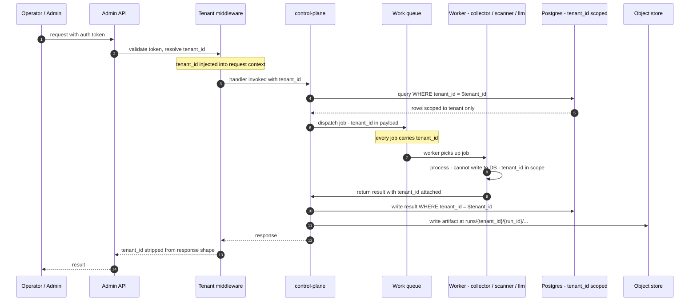
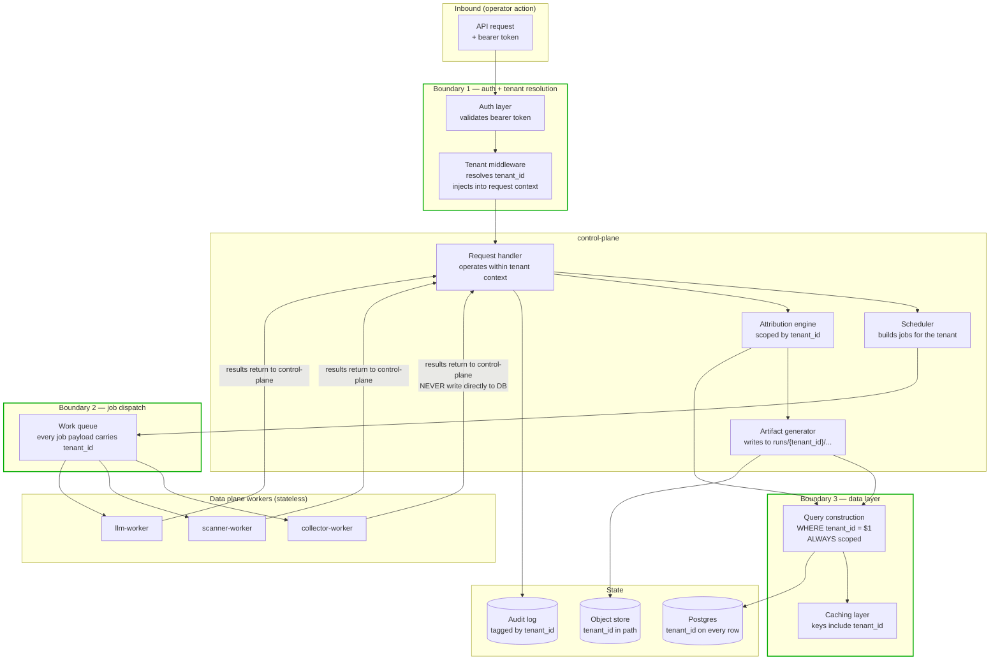

# 40 — Multi-tenancy

**What this shows.** How tenant context flows through EXPOSE Core, from an inbound API request through middleware, into the control plane, across the work queue to workers, and into the data layer — without ever crossing a tenant boundary. Per ADR-007, EXPOSE is multi-tenant in code from day one but ships single-tenant in v1 deployment with a single `default` tenant configured. The cross-tenant isolation test suite is a v1 deliverable that gates CI regardless of PR scope.

The diagram highlights where the cross-tenant isolation tests apply — at every boundary where tenant context could be lost or mixed.

## Sequence — request flow with tenant context

## Component view — where tenant context lives

The three boundaries highlighted in green are the locations where the cross-tenant isolation test suite focuses its assertions:

- **Boundary 1 — auth + tenant resolution.** The bearer token must resolve to exactly one tenant. Tokens cannot be ambiguous; tokens for tenant A cannot resolve to tenant B's data via any path.
- **Boundary 2 — job dispatch.** Every job placed on the work queue carries `tenant_id` in its payload. Workers receive `tenant_id` as part of the job context. Background jobs preserve tenant context across async boundaries (per ADR-007 cross-tenant test suite specification).
- **Boundary 3 — data layer.** Every query carries `WHERE tenant_id = $1`. Every cache key includes `tenant_id`. Every audit log entry is tagged with `tenant_id`. Every artifact path includes `tenant_id`.

## What the cross-tenant isolation tests verify

Per ADR-007, the test suite (a v1 deliverable, gating CI) exercises synthetic tenant_ids and asserts:

| Property | Test pattern |
|---|---|
| Tenant A cannot read tenant B's artifacts via any API endpoint | Synthetic tenant_a + tenant_b configured; tenant_a token used to request tenant_b artifact paths; expect 403 / 404, never tenant_b content |
| Tenant A's runs cannot reference tenant B's seeds, rules, or graph data | Tenant_a run started with tenant_b seed values; expect rejection at the seed-validation layer |
| Bearer tokens are tenant-scoped (when added in production-hardening) | Token issued for tenant_a; verify it cannot authenticate against tenant_b endpoints |
| Database query construction always scopes by tenant_id | Static analysis on query construction; runtime intercept in test mode flags any query missing tenant_id |
| Caching layer keys include tenant_id | Cache key inspection; same logical key for two tenants must produce two distinct cache entries |
| Background jobs preserve tenant context across async boundaries | Submit job for tenant_a; intercept at worker; verify tenant_a context received and propagated through any intra-job async hops |
| Audit logs from tenant A's operations are not visible to tenant B admin | Tenant_a operations logged; tenant_b admin queries audit endpoint; expect no tenant_a entries returned |

CI fails on regressions in tenant isolation tests **regardless of PR scope** — a PR that touches an unrelated module but inadvertently breaks tenant isolation will not merge.

## v1 vs. production-hardening evolution

| Capability | v1 | Production-hardening |
|---|---|---|
| Tenant lifecycle (create, configure, suspend, delete) | Hardcoded `default` tenant | Tenant lifecycle management API |
| Tenant resource quotas | Logical only — A can starve B for compute | Per-tenant resource quotas, prioritized scheduling |
| Per-tenant collector / LLM credentials | Deployment-global | Per-tenant credentials via secrets backend |
| Authenticated HTTPS API for artifact retrieval | Not present (file-system delivery) | Bearer-token auth, tenant-scoped permissions |
| GDPR / CCPA data subject deletion | Not surfaced | Tenant data export and deletion APIs |

## What "logical multi-tenancy" means in v1

ADR-007 explicitly limits v1 to **logical** isolation:

- Tenant boundaries are enforced in code and at the data layer.
- Resource isolation is **not** enforced — tenant A's run can starve tenant B's run for compute, LLM tokens, or collector API quota.
- Per-tenant credentials are **not** in v1 — collector credentials are deployment-global.
- Tenant lifecycle management is **not** an API — the single `default` tenant is hardcoded at deployment time.

These limitations are intentional: the marginal complexity of building physical isolation is high, and v1's actual deployment serves one organization. The logical boundary is where bugs would live; physical isolation is where operational maturity grows.

## Why this design — the ADR-007 reasoning, briefly

Two factors drove "multi-tenant from day one in code":

- The project is Apache 2.0 (per ADR-006). External operators will deploy it; some will want to run it for multiple orgs they consult for. Adding multi-tenancy after the fact is weeks of refactoring across the codebase.
- The Korlogos roadmap likely includes serving multiple client engagements through a single deployment as the practice scales.

The marginal cost of building tenancy now — `WHERE tenant_id = $1` in queries, tenant context in request handlers — is small compared to the design and ops complexity already committed elsewhere. Retrofitting later carries real refactor cost.

## What this diagram intentionally omits

- The specific token format for the production-hardening authenticated API.
- The tenant lifecycle management API surface (deferred per ADR-007).
- Per-tenant rate limiting and quota enforcement (production-hardening).
- The schema of the per-tenant configuration document (see SPEC §10.1).
- The audit log query path (separate concern; tagged by tenant_id but with its own retention policy).

## References

- SPEC.md §4.3 — Multi-tenancy
- SPEC.md §10.1 — Configuration (per-tenant YAML)
- ADR-007 — Multi-tenancy (logical from day one)
- `docs/issues-backlog.md` — `epic:multi-tenancy` (6 issues)
- Cross-tenant isolation test suite — a v1 deliverable per ADR-007 acceptance criteria
