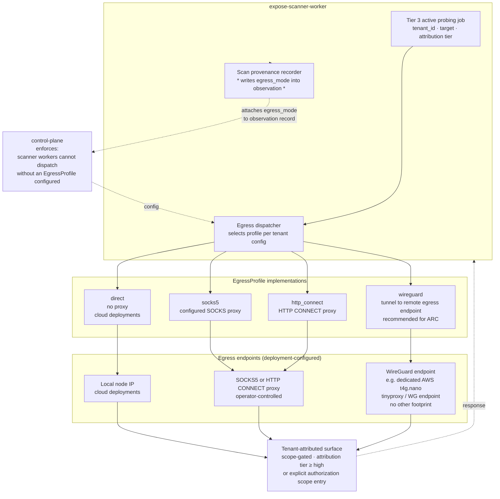
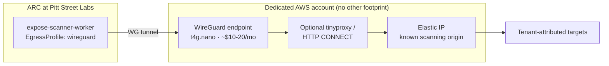

# 50 — Scanner egress

**What this shows.** The `EgressProfile` abstraction in `expose-scanner-worker`, per ADR-003 §"scanner egress" and the deployment-portability epic. Active probing — DNS resolution, TLS handshakes, HTTP fingerprinting, light port-surface enumeration — must originate from a controlled egress point. The profile abstracts that choice: `direct` for full-cloud deployments, `socks5` for proxied egress, `wireguard` for tunnel-to-remote-egress, `http_connect` for HTTP CONNECT proxies. Egress mode is logged in scan provenance for auditability.

ARC-hosted v1 deployments cannot scan from home/lab IP space without scanning third parties from inappropriate egress points. The recommended ARC pattern is a small cloud-hosted egress proxy (dedicated AWS account, `t4g.nano` Ubuntu instance with `tinyproxy` or WireGuard endpoint, ~$10-20/month) with no other footprint.

## Diagram

## EgressProfile contract

Per the deferred deployment-portability issue:

- `EgressProfile` is an interface with four implementations: `direct`, `socks5`, `wireguard`, `http_connect`.
- Scanner-worker config takes an egress-profile reference. The control plane enforces that scanner workers cannot dispatch jobs without one configured. Attempting to dispatch a Tier 3 job without an egress profile raises an error.
- Each implementation knows how to route an outbound HTTP / TLS / DNS / TCP connection through its respective egress mechanism.
- The profile reference is logged in scan provenance for every observation produced.

## Why egress isolation matters

Two threats motivate the abstraction:

**Adversary fingerprinting.** External adversaries can detect and fingerprint the EXPOSE scanner fleet. They use the fingerprint to evade discovery during scans or to attribute scanning activity back to the operator. Egress profiles route active probing through deployment-configured egress points so that scanner activity does not advertise the operator's identity.

**Inappropriate scanning origin.** ARC-hosted v1 cannot scan from home/lab IP space without scanning third parties from a residential or small-business IP space — this is operationally inappropriate and risks IP-reputation damage to the operator's primary connection. Routing scanner traffic through a dedicated cloud account (or any operator-controlled egress endpoint) keeps the operator's primary IP space out of scanning provenance.

## ARC v1 pattern: cloud-side egress proxy

Per the deployment-portability deferred issue and ADR-003 §"Hybrid":

The dedicated AWS account is intentionally minimalist: a single small instance (t4g.nano), an Elastic IP, a WireGuard endpoint, optional HTTP CONNECT proxy. No other workloads, no other footprint. Cost: ~$10-20/month per the deployment-portability issue.

## Cloud and customer-on-prem deployments

| Deployment | Recommended profile | Rationale |
|---|---|---|
| ARC v1 | `wireguard` to dedicated AWS account | Avoids scanning from home/lab IP; cheapest cloud-side footprint |
| AWS-native | `direct` | Cloud IP space is the appropriate scanning origin |
| Azure-native | `direct` | Cloud IP space is the appropriate scanning origin |
| GCP-native | `direct` | Cloud IP space is the appropriate scanning origin |
| Customer on-prem with controlled egress | `socks5` or `http_connect` to customer-provided proxy | Customer policy determines egress posture |
| Federal self-host | per agency egress policy (typically through agency proxy/firewall) | Agency egress controls inspect, log, and authorize all outbound; profile selection follows agency posture (see diagram 80) |

## Out of scope: Tor and residential proxy services

Per the deferred deployment-portability issue, **Tor egress and residential proxy services are explicitly out of scope**. Tor is operationally inappropriate for attributing scanning activity (it actively obscures origin) and incompatible with the audit trail discipline EXPOSE relies on. Residential proxy services have unresolved consent and authorization questions that do not align with the project's authorized-use posture per ADR-008 and ETHICS.md.

This is a hard out-of-scope, not a deferred-future-feature. The `EgressProfile` interface intentionally does not have a `tor` or `residential_pool` implementation, and contributions adding one will be declined.

## Where scan provenance records egress mode

Per the deployment-portability acceptance criteria, "Egress profile is logged in scan provenance for auditability." The hook lives in `expose-scanner-worker` at the boundary where an observation record is produced. Each observation carries the egress-profile identifier (and, where applicable, the egress endpoint identity) in its provenance metadata. The provenance flows back to the control plane along with the observation; the control plane writes it to the relationship row's `properties` JSONB and / or a dedicated provenance table.

When a reviewer asks "where did this scan originate from?", the answer is in the observation's provenance — egress mode, egress endpoint, scanner-worker pod identity, timestamp.

## Tier-3 attribution gating remains in force

The egress profile only affects how a scan reaches its target. **What targets are scannable** is governed separately by SPEC §6.3 collector tiers and gating: Tier 3 active probing collectors only execute against entities whose attribution tier is `confirmed` or `high`, or which are explicitly in the tenant authorization scope. The egress dispatcher does not relax this gate; attempting to dispatch a Tier 3 job for an unattributed entity raises an error regardless of egress configuration.

## What this diagram intentionally omits

- The specific WireGuard / tinyproxy configuration for the recommended cloud-side proxy (deferred to operator runbook).
- TLS fingerprint randomization (mentioned as a mitigation in SPEC §3.1; not yet a v1 deliverable).
- Distributed scan origins (multiple egress endpoints round-robined; future work).
- Per-tenant egress profile selection (v1: deployment-global; future: per-tenant).
- Metric and alert wiring for egress proxy health.

## References

- SPEC.md §3.1 — Threat model (External adversaries who detect and fingerprint the EXPOSE scanner fleet)
- SPEC.md §6.3 — Collector tiers and gating (Tier 3 attribution-gated)
- ADR-003 — Deployment posture, §"Scanner egress is configured via an `EgressProfile` abstraction"
- `docs/issues-backlog.md` — `epic:deployment-portability` → "Active scanner egress profile abstraction"
- `docs/deferred-issues/deferred-issues-decision-03.md` — full issue text including out-of-scope (Tor, residential proxies)
