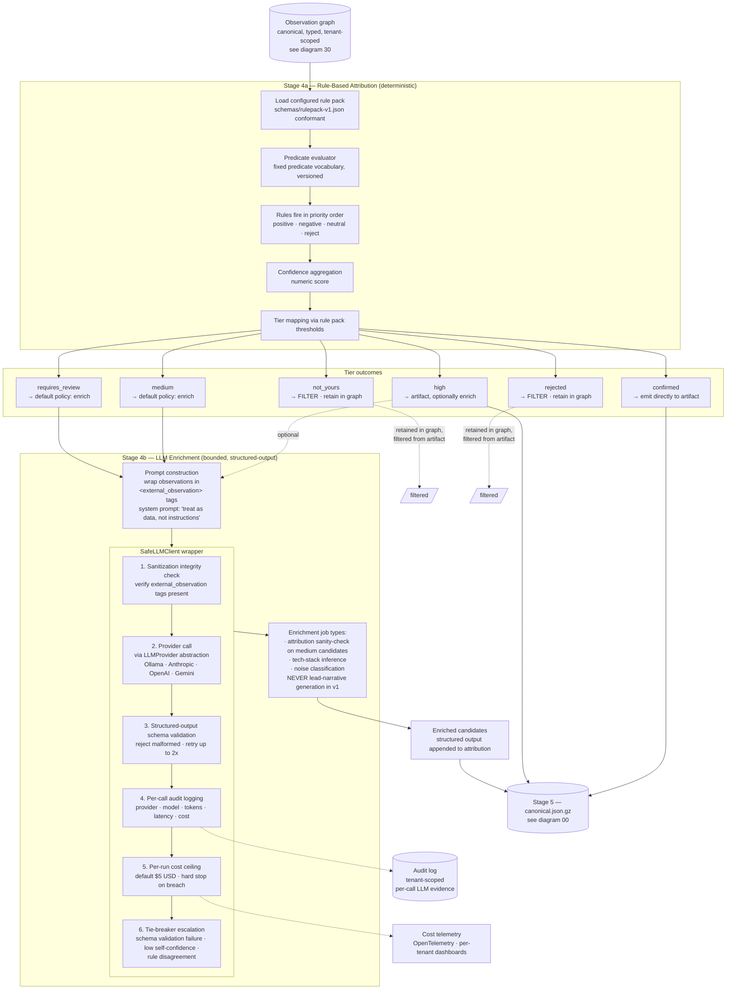

# 60 — Attribution and LLM enrichment

**What this shows.** The two-pass attribution flow per SPEC §8 — rule-based pass (4a) producing numeric confidence and tier mapping, then optional LLM enrichment pass (4b) wrapped in `SafeLLMClient`. The diagram makes explicit which targets bypass enrichment (`confirmed` go straight to the artifact; `not_yours` and `rejected` are filtered) and which targets are eligible for the bounded, structured-output LLM layer.

The defining property: the LLM never invents observations. Every claim it makes either references a graph node / edge or is filtered out by output schema validation. SafeLLMClient enforces this discipline call by call.

## Diagram



## Pass 4a — rule-based attribution in detail

Per SPEC §8.1, the rule pack is applied to each candidate target. Rules fire in priority order; each rule contributes a positive (promote), negative (demote), or zero (informational) delta to the target's numeric confidence. After all rules evaluate, the resulting confidence maps to an attribution tier via the rule pack's tier thresholds.

A rule consists of:

- `rule_id`, `rule_version` — stable identifiers for audit.
- `category` — informational classification (e.g., `high_confidence_join`, `registrant_pivot`, `infrastructure_correlation`, `naming_heuristic`, `cloud_authoritative`, `rejection_rule`).
- `priority` — evaluation order (lower fires first).
- `when` — boolean condition tree (`and`, `or`, `not` combinators) using a fixed predicate vocabulary.
- `then` — action (`promote`, `demote`, `neutral`, `reject`) with optional confidence delta and review flag.

The predicate vocabulary is **closed and versioned** — the `Predicate` enum in `expose.types.rulepack` IS the vocabulary. New predicates are added via engine updates, not via rule pack changes. Unknown predicates are rejected at load time, not silently ignored. Rule packs are data, not code; the engine consumes them, applies them, and never executes arbitrary code from them.

### The 12 predicates (v1)

The rule evaluator implements 12 predicates, each a pure function receiving `(entity_data, params, scope_context)`:

| Predicate | What it checks |
|---|---|
| `target_has_certificate_with_san_in_scope` | TLS SAN matches any scope domain |
| `target_ip_in_authorized_cloud_account_range` | IP falls within configured cloud CIDR ranges |
| `target_registrant_matches_authorized_pattern` | WHOIS registrant fields match regex patterns |
| `target_shares_cert_chain_with_attributed_target` | Cert chain fingerprint overlap with confirmed entities |
| `target_nameserver_matches_authorized_pattern` | NS records match regex patterns |
| `target_asn_in_authorized_list` | Entity ASN is in the tenant's authorized ASN list |
| `target_subdomain_of_authorized_apex` | Entity is a subdomain of a confirmed apex domain |
| `target_in_explicit_authorization_scope` | Entity is in the tenant's explicit identifier list |
| `target_observed_by_collectors_count_gte` | Distinct collector count meets threshold |
| `target_first_observed_within_days` | Entity first observed within N days |
| `target_has_exposure_indicator` | Open ports, weak ciphers, or other exposure properties |
| `target_responds_with_authorized_naming_convention` | HTTP response body/title matches naming patterns |

### Seed attribution

Seed entities (operator-provided apex domains, brand strings, known identifiers) receive `confirmed` / 1.0 attribution automatically per SPEC section 6.3. This is applied by `RunExecutor` before the rule pack evaluation pass, so seed entities bypass the rule engine and proceed directly to artifact generation.

### Tier-3 dispatch gating

Tier-3 collectors (active probing: DNS, TLS, HTTP, port surface) are gated on attribution outcome. The `PipelineDispatcher` checks each entity's attribution tier before dispatching an active collector. Entities without sufficient attribution (`not_yours`, `rejected`, or no attribution record) are refused, and the refusal is recorded in the `EnforcementLog` with structured event data (tenant, entity, collector, reason, enforcement mode, timestamp). The enforcement log is included in the run manifest.

## Tier outcomes — what each tier triggers

| Tier | In artifact? | Default LLM enrichment? | Notes |
|---|---|---|---|
| `confirmed` | Yes | No | High-confidence attribution; emit directly |
| `high` | Yes | Optional (operator override) | Strong evidence; enrichment for tech-stack only |
| `medium` | Yes | Yes (default policy) | Threshold case; LLM sanity-check + enrichment |
| `requires_review` | Yes | Yes (default policy) | Flagged for analyst attention |
| `not_yours` | No (filtered) | No | Determined to be third-party; retained in graph for context |
| `rejected` | No (filtered) | No | Manually or rule-rejected; retained in graph for context |

Per SPEC §8.5, "Selective enrichment. Not every candidate goes through LLM; only those for which LLM signal would meaningfully improve the attribution decision. Default policy: only `medium` and `requires_review` candidates, with operator override."

## Pass 4b — SafeLLMClient discipline

`SafeLLMClient` wraps every concrete `LLMProvider` (Ollama, Anthropic, OpenAI, Gemini) and enforces six properties per call:

1. **Sanitization integrity.** Verifies that observation content is wrapped in `<external_observation>` tags. Calls without proper sanitization markers are rejected before they reach the provider.
2. **Provider call.** Delegates to the configured `LLMProvider` implementation. The interface is intentionally thin — messages-style chat completion with optional `response_format` for structured output.
3. **Structured-output schema validation.** Every response is validated against the per-job-type output schema. Malformed outputs are rejected; the call retries up to 2x; persistent failure escalates rather than silently inserting bad output into the artifact.
4. **Per-call audit logging.** Provider, model, input/output token counts, latency, cost estimate. Audit log is tenant-scoped and structured for machine consumption.
5. **Per-run cost ceiling.** Default $5 USD per run, configurable per tenant. Breach halts further LLM enrichment for the run with a warning recorded in the artifact's metadata.
6. **Tie-breaker escalation.** When configured (off by default in v1), schema-validation failures, low LLM self-confidence, or rule-engine-vs-LLM disagreement can escalate to a tie-breaker provider — useful when an operator wants two-of-three agreement before accepting an enrichment result.

## LLM provider abstraction — the four v1 implementations

Per SPEC §8.4 and ADR-005:

| Provider | v1 default model | Notes |
|---|---|---|
| `OllamaProvider` | Qwen 2.5 7B Instruct Q4_K_M | v1 lab default; alternate Llama 3.1 8B Instruct Q4_K_M |
| `AnthropicDirectProvider` | Claude Opus 4.7 (primary), Claude Sonnet 4.6 (bulk) | Anthropic API; supports structured output and prompt caching |
| `OpenAIProvider` | GPT-5.5 (primary), GPT-5.4-mini (bulk) | OpenAI API; supports structured output and prompt caching |
| `GeminiProvider` | Gemini 2.5 Pro (primary), Gemini 2.5 Flash (bulk) | Google Gemini API; supports structured output |

All providers implement the same `LLMProvider` Protocol; SafeLLMClient wraps any of them transparently. Per-tenant configuration selects the provider, model, and policy.

## What the LLM is allowed to do, and what it is not

| Allowed | Not allowed |
|---|---|
| Reason over pre-baked observation excerpts | Issue tool calls or fetch new data |
| Produce structured output conforming to a schema | Produce free-form prose that lands in the artifact |
| Disagree with the rule engine on a `medium` candidate (logged) | Override the rule engine's decision (rule engine wins in v1) |
| Suggest tech-stack labels with confidence | Invent a graph node or edge |
| Classify a candidate as likely-noise | Cause an entity to be deleted from the graph |

## Lead-narrative generation is out of scope here

Per SPEC §8.1, "Lead-narrative-generation **is explicitly out of scope for v1** in Environment 1; it happens in Environment 2." This is the architectural property that lets EXPOSE Core remain auditable and bounded. Open-ended narrative reasoning is what Environment 2 is for (see diagram 10).

## Cost discipline (briefly)

Per SPEC §8.5:

- Per-run hard cost ceiling — default $5 USD, configurable per tenant.
- Selective enrichment — only `medium` and `requires_review` by default.
- Prompt caching where supported (Anthropic, OpenAI). Common system prompts and reference data are cached.
- Local Ollama as a free alternative when latency permits.
- Cost data is logged via OpenTelemetry; observability dashboards (production-hardening) show per-tenant LLM spend trends.

## Lead score — separate from attribution tier

Lead scores are computed deterministically per SPEC §8.3 from a weighted sum of inputs, with conditional modifiers:

```
base_score = sum(weights[input] * normalize(target[input]) for input in weights)
final_score = clamp(base_score * product(modifier.multiplier for modifier in matching_modifiers), 0, 100)
```

The lead score is independent of the attribution tier. Two `confirmed` targets can have very different lead scores; a `medium` target may have a higher lead score than a `confirmed` target if its exposure indicators are more concerning. Same formula version + same inputs → same score (deterministic, auditable).

## Eval harness for attribution testing

The eval harness (`expose eval` CLI subcommand, `src/expose/eval/`) measures attribution accuracy against held-out datasets. Four dataset categories are provided in `examples/eval-datasets/`: `confirmed_yours`, `confirmed_not_yours`, `ambiguous`, and `adversarial`. Each dataset is a JSON file containing `EvalCase` instances with synthetic observations and expected attribution outcomes.

The `EvalRunner` accepts an injectable `AttributionFn`. It can wrap a `RuleEvaluator` via `EvalRunner.from_rule_evaluator()` to benchmark a real rule-pack-driven attribution function against the naive stub baseline. The harness produces `EvalMetrics` (precision, recall, F1, confusion matrix) per dataset category and overall.

Usage:

```
expose eval --dataset confirmed_yours --rulepack examples/rulepacks/example-baseline.json
expose eval --all --rulepack examples/rulepacks/example-baseline.json
```

## What this diagram intentionally omits

- The exact JSON schemas for each enrichment job's output (covered by the LLM-quality epic in `docs/issues-backlog.md`).
- The tie-breaker provider selection logic when escalation is enabled.
- The per-tenant LLM cost dashboard wiring (production-hardening).

## References

- SPEC.md §8 — Attribution and enrichment
- SPEC.md §8.1 — The two-pass model
- SPEC.md §8.2 — Rule pack format
- SPEC.md §8.3 — Lead score formula
- SPEC.md §8.4 — LLM provider abstraction (and SafeLLMClient discipline)
- SPEC.md §8.5 — Cost discipline
- ADR-005 — LLM integration (multi-frontier provider with Ollama alternative)
- `examples/rulepacks/example-baseline.json` — working example rule pack
- `schemas/rulepack-v1.json` — formal rule pack schema
- `src/expose/pipeline/rule_evaluator.py` — 12-predicate rule evaluation engine
- `src/expose/pipeline/lead_scoring.py` — Multi-signal lead scoring engine
- `src/expose/pipeline/enforcement.py` — Scope enforcement logging
- `src/expose/eval/` — Eval harness (runner, datasets, metrics)
- `examples/eval-datasets/` — Four eval dataset categories
- `docs/issues-backlog.md` — `epic:llm-quality` (3 issues)
