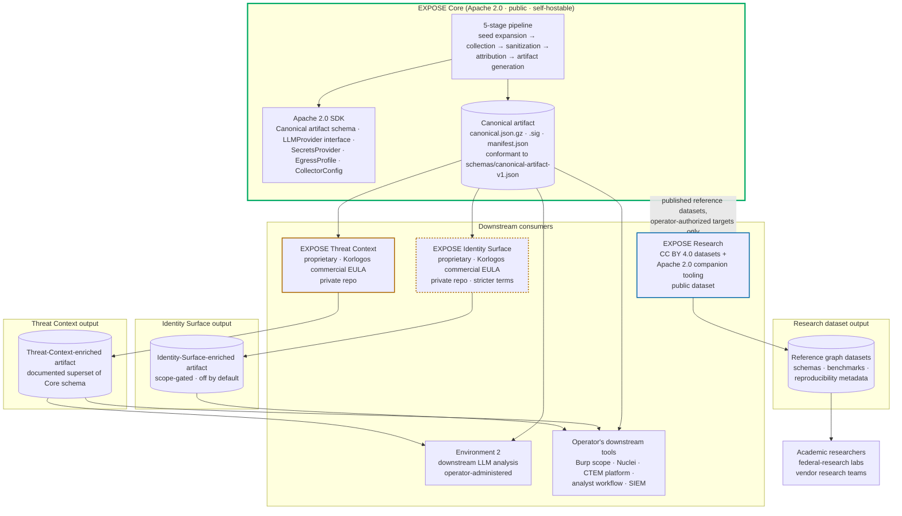
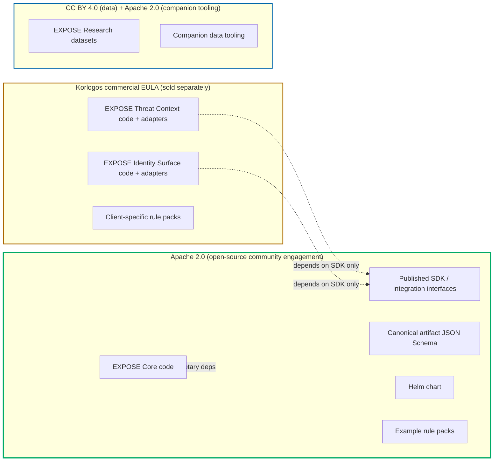

# 70 — Product surfaces

**What this shows.** The four product surfaces per ADR-009 — EXPOSE Core (Apache 2.0), EXPOSE Threat Context (proprietary), EXPOSE Identity Surface (proprietary, higher ethics bar), EXPOSE Research (CC BY 4.0 dataset) — and the license boundaries between them. EXPOSE Core produces the canonical signed JSON artifact; the commercial modules consume that artifact and produce enriched supersets; the Research dataset is curated separately from operator-authorized research targets.

The diagram makes explicit which boundary is the Apache 2.0 SDK (Core's published integration surface) and which boundaries are commercial license boundaries that a fork of Core cannot legally cross without separate licensing.

## Diagram



## License boundaries



The critical structural property per ADR-009: **Core depends on no proprietary code.** Commercial modules depend on Core via the published Apache 2.0 SDK. This preserves the property that Core can be used independently of commercial modules and that commercial modules can be developed without violating Apache 2.0 terms.

## Repository layout

Per ADR-009 §"Repository structure":

```
github.com/korlogos/ff6k-core              (Apache 2.0, public — when consent gate lifts)
github.com/korlogos/ff6k-threat-context    (proprietary, private — commercial customers only)
github.com/korlogos/ff6k-identity-surface  (proprietary, private — commercial customers only)
github.com/korlogos/ff6k-research          (CC BY 4.0 datasets + Apache 2.0 tooling, public)
github.com/korlogos/ff6k-rulepacks         (proprietary, private — client-specific rule packs)
```

Note: repository names use the internal `ff6k` prefix per the `pitt-street-labs/ff6k` lab convention; renaming Gitea / GitHub repos to `expose` is a separate decision deferred to pre-publication review per HISTORY.md.

## What each surface offers

### EXPOSE Core (Apache 2.0)

The open-source engine. Public repository. Includes:

- The discovery, sanitization, attribution, and artifact generation pipeline.
- Core collector framework and free-tier collector implementations (CT logs, public DNS, ASN/BGP, cloud IP manifests, public WHOIS/RDAP, basic active probing).
- Attribution rule engine and rule pack format.
- LLM provider abstraction with all four v1 implementations.
- Canonical artifact schema and JSON Schema files.
- Helm chart for self-deployment.
- Example rule packs sufficient to demonstrate end-to-end operation.
- Reference documentation including SPEC.md, threat model, ETHICS.md, federal customer deployment guide.

Federal customers self-host Core within their existing authorization boundary; no commercial license required (see diagram 80).

### EXPOSE Threat Context (proprietary)

Commercial module. Private repository. Consumes Core's signed artifact, produces an enriched superset artifact. Includes:

- APT targeting profile correlation.
- Dark-web IoAc (Indicators of Activity Against), IoI (Indicators of Interest), IoP (Indicators of Proof of Concept) collection and correlation, with its own ethics surface.
- Historical point-in-time enrichment (cert history, DNS history, banner history, screenshot history).
- Adversary infrastructure detection — MITRE ATT&CK Resource Development tactic monitoring (typosquats, staging infrastructure, leaked credentials in markets).
- Risk-prioritized lens combining Core attribution with threat actor targeting context.

License: Korlogos commercial EULA. Available to commercial and federal customers under separate agreement.

### EXPOSE Identity Surface (proprietary, higher ethics bar)

Commercial module. Private repository. Off by default; requires explicit per-tenant authorization scope acknowledgment with an additional attestation beyond Core's authorization scope. Includes:

- WHOIS-personnel correlation beyond what Core does (registrant graph analysis, historical registrant pivots).
- Authorized social-media tangential target discovery (LinkedIn, Twitter/X, Mastodon, Bluesky, scope-gated, for authorized red team operations).
- Personnel-graph attribution (organizational hierarchy inference from public signals).

License: Korlogos commercial EULA, with stricter contractual terms covering authorized-use representations, GDPR/CCPA handling, and explicit prohibitions on unauthorized surveillance use cases. The ethics surface is materially larger than Core's; this module's separate licensing reflects that.

### EXPOSE Research (CC BY 4.0 datasets, Apache 2.0 tooling)

Public dataset offering. Includes:

- Periodic published reference graph datasets — anonymized or fully synthetic depending on dataset.
- Reference rule packs demonstrating attribution patterns.
- Benchmark datasets for evaluating EASI tools, attribution accuracy, and AI enrichment quality.
- Dataset documentation, schemas, and reproducibility metadata.

License: Creative Commons Attribution 4.0 (CC BY 4.0) for the data; Apache 2.0 for any companion tooling. Anyone can use, redistribute, modify with attribution. The data published is sourced from operator-authorized research targets (Korlogos's own infrastructure, partnered research domains) or from synthetic generation; **never from customer deployments**.

## Why open-core

ADR-009 §"Alternatives considered" rejected:

- **Apache 2.0 everything.** Loses commercial protection for the modules; investment doesn't get done or gets done by a competitor who forks and doesn't contribute back.
- **Source-available everything (BUSL-1.1, PolyForm Strict).** Loses OSI-approved-license community engagement; federal procurement preferences favor true open-source for the engine; the engine itself does not need source-available protection because the value is in operational excellence and rule-pack tuning.
- **Mixed-license repository (engine open, modules under different license in same repo).** Creates endless confusion in dependency analysis, license auditing, and fork management.
- **Service-only commercial offering (no module licensing).** Forecloses the federal and large-enterprise self-host market segment.
- **Two-tier (Core open + one big proprietary module).** Conflates Threat Context (external threat data) with Identity Surface (personnel-reconnaissance ethics implications) — the two ethics surfaces are materially different and warrant separate licensing.

The four-surface structure is intended to be durable. Triggers for revisiting are listed in ADR-009 §"When to revisit" (significant commercial competitive threat, module consolidation pressure, Research dataset gaining independent strategic importance).

## How this maps to the three named persona personas

Per `docs/strategy/persona-analysis.md`:

| Surface | Red Teamer | Threat Researcher | Security Director |
|---|---|---|---|
| Core | Yes (operates) | Yes (operates) | Yes (procurement via internal sponsorship + open-source approval) |
| Threat Context | Yes (commercial upgrade) | Yes (research) | Yes (commercial upgrade) |
| Identity Surface | **Primary for some** | Slightly (PII research ethics) | Cautious (compliance flag) |
| Research dataset | No | **Primary motivator** | Slightly (training data) |

The Federal CDM Engineer (the daily user paired with the Security Director buyer for federal sales) is primarily a Core operator with potential Threat Context interest; Identity Surface is unlikely in federal continuous-monitoring contexts.

## What this diagram intentionally omits

- The pricing model for the commercial modules (deferred to a future GTM session).
- The specific dataset publication cadence for EXPOSE Research (deferred until Phase 2 evaluator harness lands).
- Per-adapter commercialization-risk evaluation for Threat Context data sources (some have re-licensing constraints; addressed in module-spec sessions).
- The renamed-to-`expose` Gitea / GitHub repository decision (deferred to pre-publication review per HISTORY.md).
- The integration test matrix across Core + module versions (release-engineering concern).

## References

- ADR-009 — Commercial structure (open-core + 3 commercial modules + research)
- ADR-006 — Repository and licensing (Apache 2.0 engine, private rule packs — predecessor decision)
- positioning.md §6 — The product structure
- HISTORY.md — Public name selection (EXPOSE) and codename history (FF6K)
- `docs/strategy/persona-analysis.md` — Persona-by-surface fit
