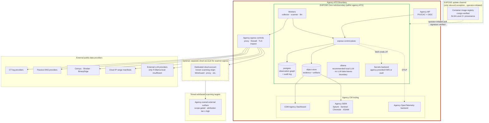

# 80 — Federal deployment pattern

**What this shows.** The generalized federal-customer self-host pattern: an agency ATO boundary contains the EXPOSE Core sub-boundary; EXPOSE artifacts feed agency CDM (Continuous Diagnostics and Mitigation) tooling and SIEM; scanner egress goes through agency-controlled egress controls (and, where appropriate, a separate cloud account); no inbound connections cross into the agency boundary from outside except the EXPOSE update channel (operator-initiated container image and configuration updates).

This diagram is the generalized pattern. The canonical SSP-authoring view lives in `docs/strategy/federal-customer-deployment-guide.md` §3.4 (mermaid) and §3.3 (ASCII art). This document does not duplicate that view — it shows the pattern at the architectural-pattern level (one diagram across deployment scenarios) and references the federal-customer guide for the SSP-authoring detail.

## The generalized pattern

## What is inside the EXPOSE Core sub-boundary

Per `federal-customer-deployment-guide.md` §3.1 — these components store, process, or transmit the canonical artifact and its underlying observation graph:

- `expose-control-plane` — orchestrator API, run scheduler, attribution engine, artifact generator. Holds run metadata, attribution decisions, audit log emission.
- `expose-collector-worker` — executes collector modules against external APIs. Stateless during execution; results returned to control plane.
- `expose-scanner-worker` — executes Tier 3 active probing. Stateless during execution; results returned to control plane.
- `expose-llm-worker` — executes LLM enrichment jobs. Stateless during execution; per-call audit log emission.
- `postgres` — observation graph, run metadata, configuration, audit log. All EXPOSE persistent state.
- Object store — evidence (raw cert PEMs, raw HTTP responses, raw DNS responses) keyed by content hash, plus canonical artifacts.
- Secrets backend reference — just-in-time credential fetch for collectors and LLM providers. Credentials held externally; EXPOSE references but does not store.
- `ollama` (recommended) — local LLM, so no observation excerpts leave the agency boundary for enrichment.

## What is external (boundary-crossing data flows)

| External service | Direction | Data flow |
|---|---|---|
| Certificate Transparency log providers | Outbound HTTPS from collector worker | Public CT log queries; no agency data transmitted beyond domain seed strings |
| Passive DNS providers | Outbound HTTPS from collector worker | Domain seed strings sent; passive DNS responses received |
| Internet-wide scan providers | Outbound HTTPS from collector worker | Search queries with seed identifiers; observations returned |
| RDAP / WHOIS providers | Outbound HTTPS from collector worker | Domain queries; registrant records returned |
| Cloud provider IP-range manifests | Outbound HTTPS from collector worker | Public manifest fetch; no authentication |
| Active probing targets (agency surface, scope-gated) | Outbound from scanner worker via EgressProfile | DNS, TLS, HTTP, port surface; gated by attribution tier |
| External LLM providers (only if Ollama local insufficient) | Outbound HTTPS from llm-worker | Sanitized observation excerpts in `<external_observation>` tags; structured output returned |
| Agency CDM Dashboard / SIEM | Inbound to agency systems from EXPOSE artifact retrieval | Canonical artifact JSON ingested by CM tooling |
| Agency identity provider (PIV/CAC, OIDC) | Inbound to control-plane admin API | Authentication assertions only |
| Time source (NTP, agency-approved authoritative) | Inbound NTP to all components | Time synchronization for AU-8 compliance |

## The "no inbound connections except update channel" property

A defining property of the federal deployment pattern: **no inbound connections cross into the agency ATO boundary from outside, except the EXPOSE update channel** — and that channel is operator-initiated (the agency pulls updates rather than the EXPOSE vendor pushing them).

The EXPOSE update channel:

- Container image registry (the agency pulls from a cosign-verified source).
- Helm chart updates (operator-applied).
- Configuration updates (operator-applied; per-tenant YAML edited locally and applied via admin tooling).

Updates flow under operator control. The EXPOSE project does not maintain inbound connectivity to agency deployments. There is no telemetry phone-home, no remote-administration channel, no support tunnel.

## The optional separate cloud account for scanner egress

For agencies that prefer to scan from a known cloud-IP origin rather than from agency IP space (operationally appropriate when scanning agency-owned external surface), a separate cloud account can host an EgressProfile endpoint (see diagram 50). The traffic flow:

1. Scanner worker (inside agency ATO boundary) initiates outbound to the cloud egress endpoint via WireGuard / SOCKS5 / HTTP CONNECT (per EgressProfile configuration).
2. Cloud egress endpoint forwards to the scanning target.
3. Response returns through the egress endpoint back to the scanner worker.

The cloud account is intentionally minimal — a single small instance (e.g., `t4g.nano`), an Elastic IP, an EgressProfile-compatible service. No other workloads, no other footprint. This is operationally identical to the ARC v1 pattern from diagram 50.

## What this enables for the agency

Per `docs/strategy/federal-customer-deployment-guide.md` and ADR-010:

- **Self-host within the agency's existing ATO** — no separate authorization required for the engine itself. EXPOSE Core's architecture (FIPS 140-3 validated cryptography, NIST 800-53 control alignment, audit logging to AU-family standards, FedRAMP-aligned configuration patterns) is built so that integration into an agency's existing ATO is feasible.
- **Continuous monitoring evidence** — the canonical artifact's signed JSON format is compatible with CDM ingestion patterns. Audit logs are AU-family-compliant.
- **Apache 2.0 license** — the agency can audit the source, modify locally if needed, contribute back if appropriate. No vendor-lock-in concerns.
- **Boundary clarity** — what is inside the EXPOSE sub-boundary, what is external, and how data crosses both the EXPOSE sub-boundary and the agency ATO boundary is documented (`federal-customer-deployment-guide.md` §3.1-3.5).

## Three deployment options at a glance

Per the federal-customer guide:

| Option | Posture | Authorization model |
|---|---|---|
| **A. Self-host within agency ATO** | EXPOSE Core inside the agency boundary; agency operates | Agency authorizes EXPOSE as a system component within the existing ATO |
| **B. Self-host in a dedicated agency-managed enclave** | EXPOSE Core in an agency-managed FedRAMP-Authorized cloud enclave | Agency leverages cloud-provider FedRAMP authorization + agency-specific add-ons |
| **C. Korlogos managed SaaS (roadmap-future)** | Korlogos operates; agency consumes | Korlogos pursues FedRAMP Moderate (Agency ATO sponsorship preferred); not currently a deployment choice |

This diagram visualizes Option A. Option B is structurally similar with the boundary residing in the cloud enclave. Option C is roadmap-future and not depicted because it would have a different boundary diagram entirely (Korlogos hosts the control plane; agency consumes via authenticated HTTPS API).

## Cross-reference: the canonical SSP-authoring view

The canonical mermaid diagram for SSP authoring lives at:

- `docs/strategy/federal-customer-deployment-guide.md` §3.4 — Mermaid view of the agency-ATO-embedded EXPOSE deployment with explicit subgraphs for the EXPOSE Core sub-boundary, agency CM tooling subgraph, agency egress controls, agency IdP, and external public-data providers.
- §3.3 — ASCII-art equivalent for environments that do not render Mermaid.

This document (diagram 80) generalizes that pattern. The federal-customer guide remains canonical for SSP work; this diagram is the architectural-pattern view that surfaces in cross-system documentation, technical reviews, and onboarding. **When the two appear to disagree, the federal-customer guide wins for SSP-authoring purposes** because it is the artifact federal authoring teams will reference directly.

## What this diagram intentionally omits

- The specific NIST 800-53 control mapping (covered in detail in `federal-customer-deployment-guide.md` and `framework-annotation.md`).
- The specific agency CM-tooling integrations (Splunk, Sentinel, Chronicle, XSIAM are exemplary; specific integration adapters are deployment-specific).
- FIPS 140-3 cryptography module identification (covered in ADR-010 and the federal-customer guide).
- Authority-to-Operate package contents (system security plan, control implementation summary, etc. — agency-side artifacts).
- The Korlogos managed-SaaS Option C (roadmap-future per ADR-010; would warrant its own diagram once the offering is real).
- Per-collector authorization-scope warning patterns (covered in SPEC §10 and the authorized-use deferred-issues epic).

## References

- `docs/strategy/federal-customer-deployment-guide.md` §3 — Authorization boundary considerations (canonical view)
- `docs/strategy/federal-customer-deployment-guide.md` §3.4 — Mermaid view (SSP authoring source)
- ADR-010 — FedRAMP-ready posture (architectural readiness in v1, authorization-deferred for engine, authorization-targeted for future commercial managed-service)
- positioning.md §4 — The federal procurement framing
- `docs/strategy/persona-analysis.md` §"Missing audience: the Federal CDM / Continuous-Monitoring Engineer" — the daily-user persona that pairs with the Security Director buyer
