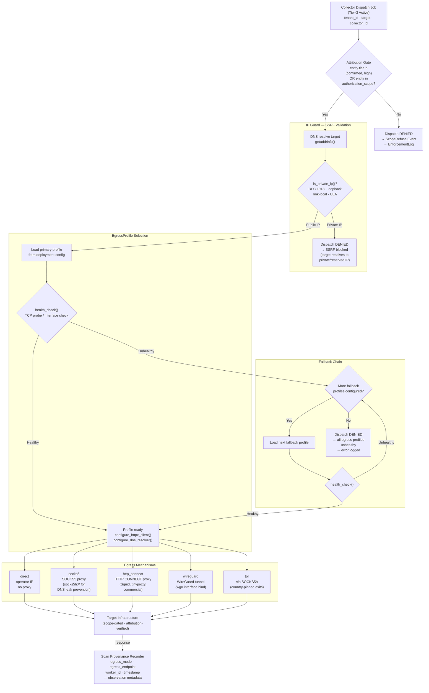
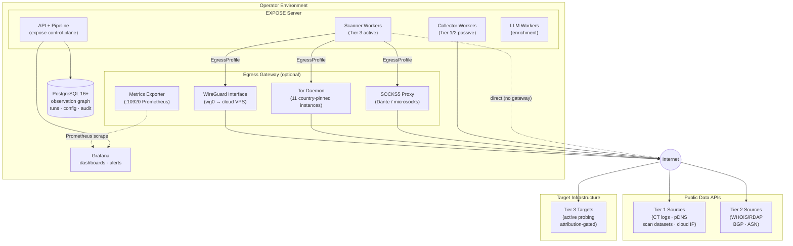

# 90 -- Egress Flow

**What this shows.** The full egress decision path for Tier-3 active collectors, from the moment a dispatch job is created through egress profile selection, IP Guard SSRF validation, fallback handling, and final connection to target infrastructure. This diagram complements diagram 50 (scanner egress component view) with a sequential flow perspective showing the decision logic and safety checks that gate every outbound active probe.

**Spec anchor:** SPEC section 6.3 (collector tiers and gating), ADR-003 (deployment posture), ADR-008 (authorized-use posture).

---

## Diagram 1: Egress Profile Selection and Dispatch

The dispatcher selects an egress profile from the deployment configuration, validates the target against the IP Guard SSRF check, then routes the connection through the selected egress mechanism. If the primary profile is unhealthy, the dispatcher walks the fallback chain before denying dispatch.

### Decision sequence

1. **Attribution gate.** The dispatcher confirms the target entity has sufficient attribution tier (`confirmed` or `high`) or is explicitly listed in the tenant's authorization scope. Entities that fail this check produce a `ScopeRefusalEvent` recorded in the `EnforcementLog` -- the scan never fires.

2. **IP Guard SSRF check.** Before any egress profile is consulted, the target hostname is resolved via `getaddrinfo()` and every returned address is checked against `is_private_ip()`. This blocks DNS-rebinding SSRF attacks where an attacker-controlled domain initially resolves to a public IP (passing seed-phase filters) but later rebinds to `10.x`, `172.16.x`, `192.168.x`, loopback, link-local, or IPv6 ULA/link-local addresses.

3. **Primary profile selection.** The deployment-configured primary `EgressProfile` is loaded and its `health_check()` is called. For SOCKS5 and HTTP CONNECT profiles, this is a TCP connect probe to the proxy host:port. For WireGuard, this checks `/sys/class/net/<interface>/operstate`. For direct, this always succeeds.

4. **Fallback chain.** If the primary profile's health check fails, the dispatcher iterates through any configured fallback profiles in order. Each fallback is health-checked before use. If all profiles are unhealthy, the dispatch is denied and the failure is logged.

5. **Egress execution.** The healthy profile configures the httpx client (proxy kwargs, transport binding) and DNS resolver (empty nameservers for DNS-through-proxy, or system resolver). The collector executes its probe through the configured egress path.

6. **Provenance recording.** Every observation produced by the collector carries the egress profile type, egress endpoint identity, scanner-worker pod identity, and timestamp in its provenance metadata. This answers "where did this scan originate from?" for any observation in the graph.

---

## Diagram 2: Deployment Topology with Egress Gateway

The full deployment view showing how the EXPOSE server, its state services, and the optional egress gateway relate to target infrastructure and public data APIs.

### Component roles

| Component | Purpose | Infrastructure |
|-----------|---------|----------------|
| EXPOSE Server | API, pipeline orchestration, worker dispatch | Container (OCI image via Helm) |
| PostgreSQL | Observation graph, run metadata, tenant config, audit log | Managed (RDS/Cloud SQL) or self-hosted |
| Grafana | Operational dashboards, egress health, pipeline metrics | Optional, deployment-provided |
| SOCKS5 Proxy | Anonymized egress for scanner workers | Dante, microsocks, or SSH tunnel |
| Tor Daemon | Geographic IP diversity via country-pinned exit nodes | 11 containers (10 countries + unrestricted) |
| WireGuard Interface | Clean-IP egress via cloud VPS tunnel | Single VPS with NAT masquerade |
| Metrics Exporter | Tor circuit health, latency, exit IP verification | Prometheus-compatible HTTP endpoint |

---

## What this diagram intentionally omits

- Per-tenant egress profile selection (v1 is deployment-global; per-tenant is future work).
- TLS fingerprint randomization (mentioned in SPEC section 3.1; not a v1 deliverable).
- Distributed scan origins with round-robin across multiple egress endpoints (future work).
- WireGuard/tinyproxy configuration details (deferred to the operator runbook in `docs/strategy/egress-deployment-guide.md`).
- Tor circuit rotation timers and container hardening (see `docs/strategy/egress-deployment-guide.md` for full reference architecture).

## References

- SPEC.md section 3.1 -- Threat model (scanner fleet fingerprinting)
- SPEC.md section 6.3 -- Collector tiers and gating
- ADR-003 -- Deployment posture
- ADR-008 -- Authorized-use posture
- `docs/architecture/50-scanner-egress.md` -- Component-level egress view
- `docs/strategy/egress-deployment-guide.md` -- Operator deployment reference
- `src/expose/egress/ip_guard.py` -- SSRF protection implementation
- `src/expose/egress/base.py` -- EgressProfile ABC
