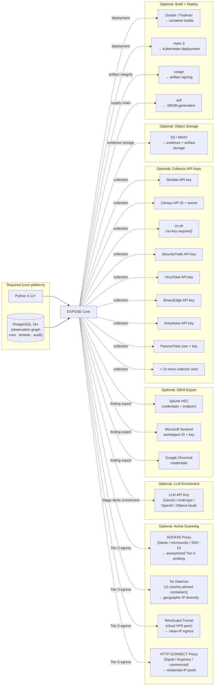

# 95 -- Dependency Map and Pipeline Stages

**What this shows.** Two views that answer operational questions: (1) what does an operator need to install and configure to run EXPOSE, organized by required vs. optional-per-feature; and (2) the full pipeline flow from seed ingestion to signed artifact, showing every processing stage in sequence.

**Spec anchor:** SPEC section 4 (Pipeline Architecture), SPEC section 11 (Implementation), ADR-003 (Deployment Posture), ADR-005 (LLM Integration).

---

## Diagram 3: Dependency Map

The dependency map separates hard requirements (EXPOSE will not start without these) from optional dependencies that unlock specific features. An operator deploying passive-only collection needs only the required stack. Active scanning, LLM enrichment, SIEM integration, and egress anonymization each bring their own dependencies.

### Dependency matrix

| Dependency | Required? | Feature unlocked | Notes |
|-----------|-----------|-----------------|-------|
| Python 3.12+ | **Yes** | Core platform | async/await, `StrEnum`, `tomllib` |
| PostgreSQL 16+ | **Yes** | Observation graph, runs, tenants | Managed (RDS/Cloud SQL) or self-hosted |
| SOCKS5 proxy | No | Anonymized active scanning | Dante, microsocks, `ssh -D`, or Tor |
| Tor | No | Geographic IP diversity (10 countries) | 11 containers, ~220 MB total RAM |
| WireGuard | No | Clean-IP tunnel egress | Cloud VPS (~$5-20/mo) |
| HTTP CONNECT proxy | No | Residential IP pools | Commercial providers ($5-15/GB) |
| LLM API key | No | Stage 4b enrichment, Stage 4c vision | Gemini, Anthropic, OpenAI, or local Ollama |
| SIEM credentials | No | Splunk/Sentinel/Chronicle export | Per-integration endpoint + auth |
| Collector API keys | No | Extended collection coverage | 31 slots; crt.sh works without a key |
| S3 / MinIO | No | Evidence + artifact object storage | Local filesystem fallback available |
| Docker / Podman | No | Container builds + deployment | Required for production; optional for dev |
| Helm 3 | No | Kubernetes deployment | Required for k8s; Compose fallback exists |
| cosign | No | Artifact signing | Keyless (OIDC) or operator keypair |
| syft | No | SBOM generation (CycloneDX 1.5) | CI pipeline integration |

---

## Diagram 4: Pipeline Stages (Seed to Artifact)

The complete pipeline flow showing every processing stage from operator-provided seeds through to the signed canonical artifact. Stages are color-coded by their trust properties: deterministic stages (no LLM), LLM-bearing stages (bounded by SafeLLMClient), and safety/enforcement checkpoints.

```mermaid
flowchart TD
    SEEDS["Operator-Provided Seeds<br/>org name · brands ·<br/>apex domains · cloud account IDs"]

    subgraph S1 ["Stage 1 — Seed Expansion"]
        DNS_FILTER["DNS Filter<br/>(validate seed domains resolve)"]
        EXPAND["Seed Expansion<br/>(rule-based pivots against<br/>authoritative public data)"]
        MULTI_TLD["Multi-TLD Expansion<br/>(DNS pre-check per TLD)"]
        DNS_FILTER --> EXPAND --> MULTI_TLD
    end

    subgraph S2 ["Stage 2 — Collection"]
        subgraph DISPATCH ["Dispatch Loop"]
            PROFILE["Target Profiling<br/>(infrastructure type · CDN ·<br/>email · WAF detection)"]
            AI_SELECT["AI-Guided Collector Selection<br/>(match collectors to target profile)"]
            PARALLEL["Parallel Dispatch<br/>(concurrent collector execution)"]
            PROFILE --> AI_SELECT --> PARALLEL
        end

        subgraph COLLECTORS ["Collector Execution"]
            direction LR
            T1["Tier 1 — Passive<br/>CT logs · pDNS · ASN/BGP<br/>scan datasets · cloud IP"]
            T2["Tier 2 — Semi-passive<br/>WHOIS/RDAP · DNS enum<br/>favicon · robots.txt"]
            T3["Tier 3 — Active<br/>DNS resolve · HTTP fingerprint<br/>port surface · screenshot<br/>(attribution-gated · EgressProfile)"]
        end

        subgraph SSRF_GATE ["Safety Gate"]
            IP_GUARD["IP Guard SSRF Check<br/>(block private/reserved IPs)"]
            ENFORCE_CHK["Attribution Tier Gate<br/>(confirmed/high or explicit scope)"]
        end
    end

    subgraph S3 ["Stage 3 — Sanitization and Normalization"]
        BATCH["Observation Batching<br/>(bulk write optimization)"]
        SANITIZE["Sanitize<br/>(strip control chars · NFC normalize<br/>length-cap · flag suspicious content)"]
        CANON["Canonicalize<br/>(IDN · IP · cert hash<br/>UTC ISO 8601 timestamps)"]
        BATCH --> SANITIZE --> CANON
    end

    subgraph UPSERT ["Entity Upsert"]
        DB_WRITE["Entity + Relationship Upsert<br/>(PostgreSQL observation graph)"]
        REL_EXTRACT["Relationship Extraction<br/>(resolves_to · presented_cert ·<br/>same_registrant · hosted_in_asn<br/>+ 6 more edge types)"]
        SUPPLY["Supply Chain Inference<br/>(50-provider fingerprint database<br/>CDN · email · hosting · SaaS)"]
        DB_WRITE --> REL_EXTRACT --> SUPPLY
    end

    subgraph S4A ["Stage 4a — Rule-Based Attribution"]
        RULE_EVAL["Rule Pack Evaluation<br/>(12-predicate vocabulary ·<br/>priority-ordered · versioned)"]
        CONFIDENCE["Confidence Aggregation<br/>(numeric score 0.0–1.0)"]
        TIER_MAP["Tier Mapping<br/>(confirmed · high · medium ·<br/>requires_review · not_yours · rejected)"]
        RULE_EVAL --> CONFIDENCE --> TIER_MAP
    end

    subgraph SCORING ["Lead Scoring"]
        LEAD["LeadScoringEngine<br/>(multi-signal aggregation)"]
        COMPOSITE["Composite Score 0–100<br/>(critical 70+ · high 40+ ·<br/>medium 20+ · low 0–19)"]
        LEAD --> COMPOSITE
    end

    TB{{"Trust Boundary<br/>deterministic graph state<br/>↓<br/>LLM context (bounded)"}}

    subgraph S4B ["Stage 4b — LLM Enrichment"]
        PROMPT["Prompt Construction<br/>(external_observation tags ·<br/>system prompt: treat as data)"]
        SAFE_LLM["SafeLLMClient<br/>schema validation · audit ·<br/>cost ceiling ($5/run) ·<br/>retry up to 2x"]
        ENRICHED["Enriched Candidates<br/>(tech-stack inference ·<br/>attribution sanity-check ·<br/>noise classification)"]
        PROMPT --> SAFE_LLM --> ENRICHED
    end

    subgraph S4C ["Stage 4c — Vision Analysis"]
        SCREENSHOT["Screenshot + Banner Capture"]
        VISION_LLM["Multimodal LLM Analysis<br/>(page type · tech detection ·<br/>security indicators ·<br/>default cred hints)"]
        SCREENSHOT --> VISION_LLM
    end

    subgraph ENFORCE ["Enforcement"]
        ENFORCE_LOG["EnforcementLog<br/>(scope refusal records ·<br/>ScopeRefusalEvent per denial)"]
    end

    subgraph S5 ["Stage 5 — Artifact Generation"]
        SERIALIZE["Canonical JSON Serializer<br/>(canonical-artifact-v1.json schema)"]
        DELTA["Delta vs. Previous Run<br/>(new · changed · removed entities)"]
        MANIFEST["Manifest Generator<br/>(run metadata · hash reference ·<br/>enforcement summary)"]
        SIGN["cosign Sign<br/>(keyless OIDC or operator keypair)"]
        STORE["Object Store<br/>(runs/tenant/run_id/<br/>canonical.json.gz + .sig +<br/>manifest.json)"]
        SERIALIZE --> DELTA --> MANIFEST --> SIGN --> STORE
    end

    SSE["RunEventBus (SSE)<br/>run_started · collector_started ·<br/>collector_completed · entities_discovered ·<br/>attribution_updated · run_completed"]

    SEEDS --> DNS_FILTER

    MULTI_TLD --> DISPATCH
    PARALLEL --> T1
    PARALLEL --> T2
    PARALLEL --> SSRF_GATE
    SSRF_GATE --> T3

    T1 --> BATCH
    T2 --> BATCH
    T3 --> BATCH

    CANON --> DB_WRITE

    SUPPLY --> RULE_EVAL
    TIER_MAP -- "confirmed → emit" --> SERIALIZE
    TIER_MAP -- "high/medium/requires_review → enrich" --> TB
    TIER_MAP -- "not_yours/rejected → filter" --> ENFORCE_LOG

    DB_WRITE --> LEAD
    VISION_LLM -. "security indicators" .-> LEAD
    COMPOSITE --> SERIALIZE

    TB --> PROMPT
    ENRICHED --> SERIALIZE

    DB_WRITE -. "vision-eligible" .-> SCREENSHOT

    SSRF_GATE -. "refusals" .-> ENFORCE_LOG
    ENFORCE_LOG --> MANIFEST

    STORE -. "lifecycle events" .-> SSE
```

### Stage summary

| Stage | Name | Deterministic? | LLM? | Key outputs |
|-------|------|---------------|------|-------------|
| 1 | Seed Expansion | Yes | No | Candidate seed graph from rule-based pivots |
| 2 | Collection | Yes | No | Raw observations from 31+ collectors across 3 tiers |
| -- | IP Guard | Yes | No | SSRF-safe target validation |
| 3 | Sanitization | Yes | No | Canonicalized, NFC-normalized, length-capped observations |
| -- | Entity Upsert | Yes | No | Observation graph nodes and edges in PostgreSQL |
| -- | Supply Chain Inference | Yes | No | Third-party provider detection (50-provider database) |
| 4a | Rule-Based Attribution | Yes | No | Numeric confidence scores and attribution tiers |
| -- | Lead Scoring | Yes | No | Composite priority score (0-100) per entity |
| 4b | LLM Enrichment | Bounded | **Yes** | Tech-stack inference, attribution sanity-check |
| 4c | Vision Analysis | Bounded | **Yes** | Page type, security indicators, default cred hints |
| -- | Enforcement | Yes | No | Scope refusal records for manifest inclusion |
| 5 | Artifact Generation | Yes | No | Signed `canonical.json.gz` + `.sig` + `manifest.json` |

### Multi-pass expansion

The dispatch loop in Stage 2 executes iteratively. Pass 1 runs all applicable collectors against the seed graph. After entity upsert, supply chain inference, and relationship extraction, newly discovered entities may qualify as additional seeds for Pass 2+. Each pass applies the same attribution gate and IP Guard checks. The pipeline terminates when no new seeds are discovered or the configured pass limit is reached.

### Pipeline safety properties

Four properties are enforced across all stages:

1. **Attribution gating.** Tier-3 active collectors only fire against entities with `confirmed` or `high` attribution tier, or entities explicitly in the tenant authorization scope. Every refusal is recorded.

2. **SSRF protection.** The IP Guard checks every resolved IP against RFC 1918, loopback, link-local, and ULA ranges before any outbound connection. This blocks DNS-rebinding attacks at connect time.

3. **LLM containment.** Stages 4b and 4c are the only LLM-bearing stages. SafeLLMClient enforces sanitization integrity, output schema validation, per-call audit logging, and per-run cost ceiling. The LLM never invents observations.

4. **Artifact integrity.** The canonical artifact is cosign-signed. The manifest includes a content hash of the canonical file, a summary of enforcement refusals, the rule pack version, and the egress profile used. Downstream consumers can verify the full chain from seed to artifact.

---

## What these diagrams intentionally omit

- Work queue implementation details (NATS JetStream default; abstracted per SPEC section 12).
- Per-collector rate limiting and partial-run semantics (see SPEC section 6.5).
- Specific rule-pack predicate definitions (see `schemas/rulepack-v1.json`).
- Per-LLM-provider interaction details (see diagram 60).
- Network policies and east-west traffic restrictions (see Helm chart).
- Backup and recovery wiring (deployment-owned per SPEC section 10.4).

## References

- SPEC.md section 2.2 -- Pipeline stages
- SPEC.md section 3 -- Threat model (trust boundaries)
- SPEC.md section 4.1 -- Deployment topology
- SPEC.md section 6.3 -- Collector tiers and gating
- SPEC.md section 7 -- Sanitization and normalization
- SPEC.md section 8 -- Attribution and enrichment
- SPEC.md section 9 -- Artifact generation
- ADR-003 -- Deployment posture
- ADR-005 -- LLM integration
- ADR-008 -- Authorized-use posture
- `docs/architecture/00-pipeline-stages.md` -- High-level pipeline view
- `docs/architecture/20-deployment-topology.md` -- Component topology
- `docs/architecture/50-scanner-egress.md` -- Egress component view
- `docs/architecture/60-attribution-and-llm-enrichment.md` -- Attribution flow detail
- `src/expose/egress/ip_guard.py` -- SSRF protection implementation
- `src/expose/pipeline/run_executor.py` -- Pipeline orchestration
