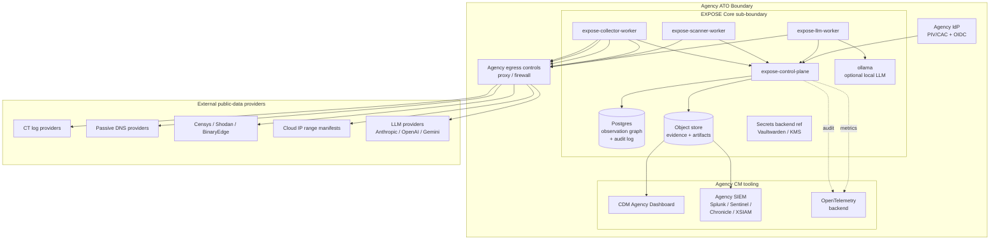

# EXPOSE — Federal Customer Deployment Guide

**Status:** Advisory — not locked. Open for revision in subsequent sessions, sponsoring-agency input, and 3PAO consultation.
**Date:** 2026-05-10
**Author context:** AI-assisted synthesis grounded in the locked spec-phase artifacts (SPEC.md, ADR-007, ADR-008, ADR-009, ADR-010, positioning.md) and the Session E framework annotation. Federal-program citations confirmed via May 2026 web research against the official publishers (CISA, FedRAMP PMO, NIST).
**Public name:** EXPOSE (selected 2026-05-10 in Session H) / **Internal codename:** FF6K
**Source files cited:** `docs/SPEC.md`, `docs/positioning.md`, `docs/adr/ADR-003-deployment-posture.md`, `docs/adr/ADR-007-multi-tenancy.md`, `docs/adr/ADR-008-authorized-use-and-ethics.md`, `docs/adr/ADR-009-commercial-structure.md`, `docs/adr/ADR-010-fedramp-ready-posture.md`, `docs/strategy/persona-analysis.md`, `docs/strategy/framework-annotation.md`, `schemas/canonical-artifact-v1.json`, `schemas/manifest-v1.json`, `SECURITY.md`, `ETHICS.md`.

This document is the integration playbook a federal agency uses to deploy EXPOSE Core inside its own Authority To Operate (ATO) boundary. It operationalizes the FedRAMP-ready posture committed in ADR-010 and the control mapping produced in Session E (`docs/strategy/framework-annotation.md`), and it makes the buyer/operator persona distinction surfaced in Session E persona-analysis.md §"Missing Audience" explicit throughout.

This is advisory analysis pending 3PAO review and sponsoring-agency dialogue. The control inheritance claims here cite Session E's mapping at depth and mark every position as **Satisfies**, **Partially satisfies**, **Provides evidence for**, or **Out of scope** using the same taxonomy.

---

## 1. Audience and pre-requisites

EXPOSE has two distinct federal personas. The buyer/sponsor and the operator are not the same person. Confusing them produces failed RFP responses and unanswerable post-procurement questions. This guide addresses both, with section-by-section signposting.

### 1.1 The buyer persona — Federal CISO / Contracting Officer

| Attribute | Detail |
|---|---|
| Title examples | Agency CISO, Deputy CISO for Continuous Monitoring, Authorizing Official, Contracting Officer's Representative for cyber tools |
| Primary concern | Integration into the agency's existing ATO without inheriting unbounded vendor risk; defensible procurement record; alignment with the agency's CDM program participation |
| Reads | Sections 1, 3, 7, 12, 13, 14, 15 |
| Decision authority | Procurement approval; SSP-update sponsorship; internal go/no-go on self-host |

### 1.2 The operator persona — Federal CDM Engineer / Continuous Monitoring Lead

This persona was surfaced explicitly in `docs/strategy/persona-analysis.md` §"Missing Audience" and is documented here as a first-class user persona, paired with the Security Director buyer.

| Attribute | Detail |
|---|---|
| Title examples | CDM Engineer, Continuous Monitoring Lead, Security Operations Engineer (Federal), CDM Agency Dashboard administrator |
| Primary concern | Daily ingestion of EXPOSE artifacts into agency CDM tooling and SIEM; integrity verification; schema stability across releases; alert hygiene when authorization-scope warnings fire |
| Reads | Sections 1, 4, 5, 6, 8, 9, 10, 11, 15 |
| Decision authority | Day-to-day operational configuration; escalation to CISO when artifacts surface previously-unknown attack surface or unexpected `outside_authorized_scope` events |

### 1.3 Assumed agency context

This guide assumes the agency has the following baseline before deployment:

| Pre-requisite | Why it matters |
|---|---|
| Existing FedRAMP Moderate baseline familiarity | Section 7 control inheritance assumes the SSP author can read NIST SP 800-53 Rev 5 control narratives without translation |
| NIST RMF (SP 800-37 Rev 2) process knowledge | The deployment runbook in Section 6 maps to RMF Step 2 (Select), Step 3 (Implement), and Step 6 (Monitor) — the agency must know which step they're operating in |
| At least one approved Authorizing Official (AO) | Self-hosting EXPOSE Core within the agency ATO requires the AO to formally accept the engine into the SSP boundary |
| Existing CDM Agency Dashboard tenancy or alternate CM tooling | Section 8 ingestion patterns assume the agency has an evidence-pipeline destination |
| Internal Kubernetes capability or willingness to deploy k3s | EXPOSE is Helm-distributed (ADR-003); operators without Kubernetes capability will need a sponsoring-agency-managed deployment instead (Section 3, Option B) |
| Sponsoring agency relationship for EXPOSE itself (optional, only for Section 3 Option B) | Required only if agency elects the sponsoring-managed deployment pattern |

### 1.4 What this guide is not

- It is not a FedRAMP authorization claim. EXPOSE Core is FedRAMP-ready by architecture (per ADR-010); it is not FedRAMP-authorized. See Section 7 for the precise distinction.
- It is not a substitute for a 3PAO assessment. Every "Satisfies" claim in Section 7 is the engine's self-attestation. A 3PAO must independently verify when the agency uses EXPOSE Core as inheritable evidence.
- It is not a vendor SSP. Agencies write their own SSPs. EXPOSE Core supplies inheritable evidence packages; the SSP narrative is agency work product.
- It is not a guarantee that BOD 23-01 reporting cadence and format will be satisfied without transformation. See Section 11 — the agency must verify the exact CDM ingestion format with their CDM integrator.

---

## 2. Deployment options

Three patterns are available. The choice is driven by who runs the engine, who owns the data plane, and which FedRAMP authorization path applies.

### 2.1 Pattern comparison

| Dimension | Option A: Self-host within agency ATO (recommended) | Option B: Sponsoring-agency-managed service preview | Option C: Korlogos commercial managed service (roadmap-future) |
|---|---|---|---|
| **Maturity** | Available v1 | Available v1 with sponsoring-agency engagement | Roadmap-future per ADR-010; not v1 |
| **FedRAMP path** | Inherits agency ATO; no separate FedRAMP authorization needed (per ADR-010 Commitment 2) | Inherits sponsoring agency ATO; consuming agencies leverage via inter-agency agreement | Targets FedRAMP Moderate Agency Authorization (per ADR-010 Commitment 3) |
| **Data residency** | Inside agency boundary | Inside sponsoring agency boundary; consumer agencies receive artifacts by approved channel | Inside Korlogos-managed FedRAMP boundary |
| **Cost model** | Software is free (Apache 2.0); agency bears infrastructure + operations cost | Sponsoring agency bears infrastructure + ops; consumer agencies negotiate access | Subscription pricing; not yet defined |
| **Operations responsibility** | Agency operates entirely | Sponsoring agency operates; consumer agencies consume artifacts only | Korlogos operates entirely |
| **Authorization timeline to first run** | Days to weeks (depending on CCB cadence and existing Helm/Postgres availability) | Weeks (subject to inter-agency agreement) | 18-24 months estimated to FedRAMP Moderate (per ADR-010) |
| **3PAO assessment required for EXPOSE** | No (engine inherits agency assessment scope; agency 3PAO assesses agency boundary, EXPOSE evidence is inheritable) | Yes (sponsoring agency 3PAO assesses sponsoring boundary including EXPOSE) | Yes (FedRAMP-required) |
| **Korlogos support contract** | Not by default; paid integration assistance available (Section 13) | Not by default | Included |
| **Recommended for** | Agencies with internal Kubernetes capability and SSP authorship capacity | Agencies wanting EXPOSE benefits without operating it; pilot programs across agencies | Agencies preferring SaaS over self-host once available |
| **Migration path** | Can migrate to Option C when commercial service launches | Can migrate to Option A or Option C | Terminal pattern |

### 2.2 Recommendation

**Option A (self-host within the agency ATO) is the recommended pattern for v1**, consistent with ADR-010 Commitment 2. The agency owns the data plane, inherits no vendor-side authorization risk, and integrates EXPOSE Core into its existing continuous-monitoring evidence stream. The architecture is intentionally portable (per ADR-003); the engineering investment to deploy is bounded.

**Option B is appropriate for inter-agency pilots** where one well-resourced agency hosts and others consume artifacts. This pattern requires an inter-agency agreement (or memorandum of understanding) addressing data sharing, scope authorization, and incident escalation. It is not the default.

**Option C is roadmap-future and not currently a deployment choice.** Agencies that prefer SaaS may consider Option A with a planned migration to Option C if and when Korlogos achieves Agency Authorization.

---

## 3. Authorization boundary considerations

ADR-010 §"Boundary clarity in design documentation" commits that boundary clarity is documented in v1 even though EXPOSE is not authorized in v1. This section operationalizes that commitment.

### 3.1 What is inside the EXPOSE Core boundary

The EXPOSE Core boundary contains the components that store, process, or transmit the canonical artifact and its underlying observation graph. For Option A (self-host within agency ATO), the EXPOSE boundary is a sub-boundary of the agency ATO boundary.

| Component | Role | State held |
|---|---|---|
| `expose-control-plane` | Orchestrator API, run scheduler, attribution engine, artifact generator | Run metadata, attribution decisions, audit log emission |
| `expose-collector-worker` | Executes collector modules against external APIs | Stateless during execution; collector results returned to control plane |
| `expose-scanner-worker` | Executes Tier 3 active probing | Stateless during execution; scan results returned to control plane |
| `expose-llm-worker` | Executes LLM enrichment jobs | Stateless during execution; per-call audit log emission |
| `postgres` | Observation graph, run metadata, configuration, audit log | All EXPOSE persistent state |
| Object store (`minio` or S3-compatible) | Evidence (raw cert PEMs, raw HTTP responses, raw DNS responses) keyed by content hash; canonical artifacts | Evidence + artifacts |
| Secrets backend reference (Vaultwarden / cloud-native KMS) | Just-in-time credential fetch for collectors and LLM providers | Credentials (held externally; EXPOSE references but does not store) |

### 3.2 What is external to the EXPOSE Core boundary

These are connected services. The agency's data flows cross from the EXPOSE boundary to these external systems via documented egress points.

| External service | Connection direction | Data flow |
|---|---|---|
| Certificate Transparency log providers (crt.sh, certstream, Censys CT) | Outbound HTTPS from `expose-collector-worker` | Public CT log queries; no agency data transmitted beyond domain seed strings |
| Passive DNS providers (SecurityTrails, Validin, Farsight) | Outbound HTTPS from `expose-collector-worker` | Domain seed strings sent; passive DNS responses received |
| Internet-wide scan providers (Censys, Shodan, BinaryEdge) | Outbound HTTPS from `expose-collector-worker` | Search queries with seed identifiers; observation results returned |
| RDAP / WHOIS providers | Outbound HTTPS from `expose-collector-worker` | Domain queries; registrant records returned |
| Cloud provider IP range manifests (AWS, Azure, GCP) | Outbound HTTPS from `expose-collector-worker` | Public manifest fetch only; no authentication |
| Active probing targets (operator's own surface, scope-gated) | Outbound from `expose-scanner-worker` via configured egress profile | DNS queries, TLS handshakes, HTTP fingerprints; gated by attribution tier per ADR-008 |
| LLM providers (Anthropic, OpenAI, Gemini, Ollama-local) | Outbound HTTPS from `expose-llm-worker` (or local for Ollama) | Sanitized observation excerpts in `<external_observation>` tags; structured output returned |
| Agency CDM Agency Dashboard / SIEM (Splunk, Sentinel, Chronicle, Cortex XSIAM) | Inbound to agency systems from EXPOSE artifact retrieval | Canonical artifact JSON ingested by CM tooling |
| Agency identity provider (PIV/CAC, OIDC) | Inbound to `expose-control-plane` admin API | Authentication assertions only |
| Time source (NTP, agency-approved authoritative source) | Inbound NTP to all EXPOSE components | Time synchronization for AU-8 compliance |

### 3.3 Data flows that cross the boundary

```
                                     Agency ATO Boundary
   +----------------------------------------------------------------------+
   |                                                                      |
   |    EXPOSE Core sub-boundary                                          |
   |   +--------------------------------------------------------+         |
   |   |                                                        |         |
   |   |   control-plane <---> postgres <---> object store      |         |
   |   |        ^                                               |         |
   |   |        |                                               |         |
   |   |   workers (collector, scanner, llm)                    |         |
   |   |        |                                               |         |
   |   +--------|-----------------------------------------------+         |
   |            |                                                         |
   |            v   (egress through agency-controlled boundary)           |
   |   +--------------------------------------------------------+         |
   |   |  Agency egress controls (proxy, firewall, TLS inspect) |         |
   |   +--------------------------------------------------------+         |
   |            |                                                         |
   |            v   (artifact retrieved by CM tooling)                    |
   |   +--------------------------------------------------------+         |
   |   |  Agency CDM Dashboard / SIEM / continuous-monitoring   |         |
   |   +--------------------------------------------------------+         |
   |                                                                      |
   +----------|-----------------------------------------------------------+
              |
              v   (egress to public Internet for collectors)
   +----------------------------------------------------------------------+
   |  External public-data providers (CT logs, pDNS, scan APIs, RDAP)     |
   |  LLM providers (or Ollama local within boundary)                     |
   +----------------------------------------------------------------------+
```

### 3.4 Network architecture (mermaid view)



### 3.5 Boundary documentation requirements for the SSP

When the agency updates its SSP to incorporate EXPOSE Core, the following boundary statements should be included verbatim or in agency-tailored form:

- "EXPOSE Core is a sub-boundary within the [agency system name] authorization boundary. All EXPOSE Core components (control plane, workers, Postgres, object store) execute on agency-controlled infrastructure within the existing ATO scope."
- "External data providers (CT logs, passive DNS, internet-wide scan APIs, RDAP, cloud IP manifests, optional commercial LLM providers) are external connected services accessed via agency-controlled egress. These services are not within the EXPOSE Core or agency boundary."
- "EXPOSE Core observes external attack surface data only. It does not store, process, or transmit federal data within the FedRAMP definition; the data EXPOSE collects is publicly observable about federal systems, not federal mission data."
- "Collector and LLM-provider credentials are held in the agency-approved secrets backend referenced by EXPOSE. Credentials are fetched just-in-time per call (per SPEC.md §6.4)."

---

## 4. Pre-deployment readiness checklist

The agency must have these decisions and infrastructure components in place before deployment begins. This is the operator persona's pre-flight inventory.

| Item | Decision required | Reference |
|---|---|---|
| **Postgres infrastructure** | Managed Postgres (RDS, Cloud SQL, agency-managed PostgreSQL cluster). Self-managed Postgres acceptable for lab; not recommended for production. FIPS-mode OpenSSL required (per ADR-010). | ADR-003, ADR-010 |
| **Object storage** | S3-compatible bucket (agency-approved). MinIO acceptable for lab. Bucket-level encryption with FIPS-validated cipher suites. | ADR-003, ADR-010 |
| **Secrets backend** | Agency-approved KMS (AWS Secrets Manager, Azure Key Vault, GCP Secret Manager, HashiCorp Vault, Vaultwarden for lab). FIPS-validated key management. | SPEC.md §6.4, ADR-010 |
| **Kubernetes cluster** | Agency-approved Kubernetes distribution (k3s for small footprints, EKS/AKS/GKE/OpenShift for production). Must support standard NetworkPolicies and PodSecurityStandards (restricted profile). | ADR-003 |
| **Observability backend** | OpenTelemetry-compatible backend (Prometheus + Loki + Tempo, Datadog, Splunk OTel, agency Grafana stack). | SPEC.md §10.2, ADR-010 |
| **Networking egress** | Agency-controlled egress to allowlisted external data providers (Section 3.2). Egress must support TLS 1.3 with FIPS-approved cipher suites. | SPEC.md §1.2, ADR-010 |
| **Active scanner egress profile decision** | If active probing is enabled, decide egress source: cloud-account-isolated proxy (recommended), agency-controlled scanning origin, or none (passive-only deployment). | ADR-003, ADR-008 |
| **Time source** | Authoritative NTP source (agency-approved Stratum 1 or Stratum 2). | ADR-010 (AU-8) |
| **Identity provider** | OIDC IdP (agency PIV/CAC IdP integration via OIDC adapter, or direct PIV/CAC where supported). | ADR-010 (IA-2, IA-8) |
| **CM tooling integration target** | CDM Agency Dashboard, agency SIEM, or both. Determines artifact-retrieval pattern (Section 8). | Section 8 |
| **Tenant authorization scope** | Agency must enumerate the apex domains, cloud accounts, registrant patterns, and ASN ranges within EXPOSE's authorization scope. Per ADR-008. | ADR-008, SPEC.md §10.1 |
| **Run cadence decision** | Default daily 02:00 UTC; agency may select alternate cadence within BOD 23-01 cadence floor (Section 11). | SPEC.md §10.3 |
| **Retention policy** | `incidental_days` (default 30) and evidence retention (1 year hot / 7 years cold default per SPEC.md §5.5). Agency sets to FedRAMP-required values. | ADR-008, SPEC.md §5.5 |
| **LLM provider selection** | Ollama-local (recommended for cost-bound and isolation-conscious deployments), or commercial provider (Anthropic / OpenAI / Gemini) where the provider's terms-of-service and data handling are acceptable to the agency. | ADR-005, SPEC.md §8.4 |
| **Cosign signing mode** | Keyless via OIDC (preferred when agency supports Sigstore Fulcio integration), or keypair (operator-controlled key, per SPEC.md §9.4). | SPEC.md §9.4 |
| **Backup destination** | Agency backup target for Postgres dumps and object-store replication. | SPEC.md §10.4 |
| **Incident response integration** | Agency IR plan reference; the Section 10 incident-response patterns must be wired into agency on-call. | Section 10 |
| **Sponsoring AO concurrence** | Authorizing Official has reviewed Section 7 control inheritance summary and concurs with sub-boundary inclusion. | RMF Step 2 (Select) |

This checklist is the gate between Section 5 (deployment runbook entry) and Section 6 (deployment runbook execution). The operator persona should track each row to closure before scheduling deployment.

---

## 5. Step-by-step deployment runbook

This runbook is structured in six phases. Each phase is gated by a verification step. The operator persona executes; the buyer persona reviews phase-completion artifacts before authorizing the next phase.

### 5.1 Phase A — Pre-flight

**Objective:** Establish that the agency context supports EXPOSE Core and that authorization scope is correctly configured before any infrastructure provisioning.

| Step | Action | Verification |
|---|---|---|
| A.1 | Complete the readiness checklist (Section 4). All rows must show closure. | Pre-flight checklist sign-off by operator persona |
| A.2 | Conduct control inheritance assessment using Section 7. Identify which controls EXPOSE satisfies, which the agency completes, and which require shared narrative. | Inheritance summary attached to SSP update package |
| A.3 | Tenant scoping decision. The default is single-tenant (`default` per ADR-007). Agencies operating multiple sub-organizations may configure per-org tenants. | Tenant configuration document approved by AO |
| A.4 | Authorization-scope configuration. Enumerate apex domains, cloud accounts, registrant patterns, ASN ranges. Choose `enforcement_mode` (`soft`, `medium`-default, or `hard` per ADR-008). | Scope YAML reviewed by CISO; medium or hard recommended for federal deployments |
| A.5 | FIPS-mode crypto verification. Confirm the deployment Kubernetes cluster, Postgres, and container images execute crypto operations through FIPS 140-3 validated modules per ADR-010. | FIPS module identification document; `python -c "import ssl; print(ssl.OPENSSL_VERSION)"` shows FIPS-validated OpenSSL inside containers |
| A.6 | Sponsoring AO concurrence captured in writing. | Email or formal memo from AO concurring with sub-boundary inclusion |

### 5.2 Phase B — Infrastructure provisioning

**Objective:** Stand up the dependent infrastructure (Postgres, object store, secrets backend, Kubernetes cluster, observability) the EXPOSE Helm release expects.

| Step | Action | Verification |
|---|---|---|
| B.1 | Provision managed Postgres (FIPS-mode OpenSSL). Create database `expose`. Generate connection-string secret in agency secrets backend. | `psql` connection succeeds with TLS 1.3; `SHOW ssl_cipher;` returns FIPS-approved suite |
| B.2 | Provision object store bucket. Enable bucket-level encryption with FIPS-validated cipher suite. Configure bucket policy to allow only EXPOSE service account write access. | Bucket inspection shows encryption enabled; access denied for unauthorized principals |
| B.3 | Configure secrets backend with placeholders for collector credentials, LLM provider credentials, and EXPOSE component secrets. Do not yet populate collector credentials. | Secret references resolvable from Kubernetes service account |
| B.4 | Provision or identify Kubernetes namespace `expose`. Apply NetworkPolicies restricting east-west traffic (per Section 5.3 below). Enable PodSecurityStandards `restricted` profile. | Namespace inspection shows NetworkPolicies and PSS restricted |
| B.5 | Provision OpenTelemetry collector endpoint reachable from EXPOSE namespace. Configure agency-side audit-log retention per FedRAMP-required durations. | OTLP endpoint reachable; test trace appears in backend |
| B.6 | Configure NTP to authoritative agency-approved time source on the Kubernetes nodes. | `chronyc sources` (or equivalent) shows authoritative source |

### 5.3 Phase C — EXPOSE Core installation via Helm

**Objective:** Install the EXPOSE Core Helm release with agency-specific values, secrets injection, and network policies.

| Step | Action | Verification |
|---|---|---|
| C.1 | Verify the Helm chart signature with cosign before install. Confirm chart version matches the version recorded in the agency SSP. | `cosign verify` succeeds; chart version matches SSP |
| C.2 | Render the agency `values.yaml` (Section 5.4 template) with environment-specific Postgres connection, object store reference, secrets backend reference, OTLP endpoint, IdP issuer, and tenant configuration. | Rendered values reviewed by operator persona |
| C.3 | Apply NetworkPolicies and Helm release in dry-run mode first. Inspect proposed resources. | Dry-run output reviewed; no unexpected cluster-scope resources |
| C.4 | Install Helm release. Wait for all pods to reach `Ready`. | `kubectl get pods -n expose` shows all components Ready |
| C.5 | Inject collector credentials into secrets backend. Inject LLM provider credentials if commercial provider is configured (skip for Ollama-local). | Credential references resolvable; collector health check passes (next step) |
| C.6 | Initial collector health check via control-plane API. All enabled collectors report reachable. | Health check returns green for all enabled collectors |
| C.7 | Verify OpenTelemetry trace, metric, and log emission to agency backend. | Sample trace, metric, and audit-log entry visible in agency backend |

### 5.4 Helm values file template (illustrative)

This template captures the agency-specific surface. It is not the full chart values — only the deployment-decision-bearing keys. Refer to the chart's `values.yaml` and `README.md` for the complete schema.

```yaml
# values-agency.yaml — agency-specific overlay for the EXPOSE Helm chart
global:
  fips:
    enabled: true            # enforces FIPS-validated crypto modules at startup
  imageRegistry: "registry.agency.local/mirror/korlogos"   # agency-mirrored images
  imagePullSecrets:
    - name: agency-registry-pull
  podSecurityContext:
    runAsNonRoot: true
    seccompProfile:
      type: RuntimeDefault

postgres:
  external: true
  connectionStringSecretRef:
    name: expose-postgres-conn
    key: dsn

objectStore:
  type: s3
  bucket: agency-expose-artifacts
  region: us-gov-east-1
  credentialsSecretRef:
    name: expose-objectstore-creds

secretsBackend:
  type: aws-secrets-manager     # or: vault, vaultwarden, azure-key-vault, gcp-secret-manager
  awsRegion: us-gov-east-1

observability:
  otlp:
    endpoint: otel-collector.observability.svc:4317
    tls: true

identity:
  oidc:
    issuer: https://idp.agency.gov/oidc
    clientId: expose-admin
    requirePIV: true

tenants:
  - id: "00000000-0000-0000-0000-000000000001"
    name: "agency-default"
    seeds:
      - { type: domain, value: agency.gov }
      - { type: organization, value: "Example Federal Agency" }
    authorization_scope:
      enforcement_mode: medium      # or 'hard' for stricter deployments
      apex_domains: [agency.gov, agency.mil]
      cloud_accounts:
        - { provider: aws, account_id: "123456789012" }
      registrant_patterns: ["Example Federal Agency"]
    collectors:
      enabled:
        - ct-crtsh
        - cloud-aws-ranges
        - cloud-azure-ranges
        - cloud-gcp-ranges
        - bgp-he-toolkit
        - whois-rdap
        - active-dns-resolve
        - active-tls-handshake
        - active-http-fingerprint
      credentials_secret_ref: expose-collector-creds
    rule_pack:
      pack_id: example-baseline
      pack_version: "0.1.0"
    llm:
      provider: ollama
      model: "qwen2.5:7b-instruct-q4_K_M"
      endpoint: "http://ollama:11434"
      cost_ceiling_usd: 5.00
      enrichment_policy: medium_and_review_only
    retention:
      incidental_days: 30
    run_schedule:
      cron: "0 2 * * *"

signing:
  mode: keyless                 # keyless via OIDC preferred; 'keypair' for offline
  oidcIssuer: https://idp.agency.gov/oidc

scanner:
  egressProfile:
    type: socks5                # or: direct, wireguard, http_connect
    endpoint: scanner-egress.agency.gov:1080
```

### 5.5 NetworkPolicy outline

The Helm chart ships default NetworkPolicies; the agency may need to extend or replace them. Minimum required restrictions:

| From | To | Allowed |
|---|---|---|
| `expose-control-plane` | Postgres | Yes (TLS 1.3) |
| `expose-control-plane` | Object store | Yes (TLS 1.3) |
| `expose-control-plane` | Secrets backend | Yes (TLS 1.3) |
| `expose-control-plane` | OTLP collector | Yes |
| `expose-collector-worker` | Public internet via egress | Yes (allowlisted destinations) |
| `expose-scanner-worker` | Configured egress profile | Yes |
| `expose-llm-worker` | LLM provider (commercial) or `ollama` (local) | Yes |
| Workers | Postgres / Object store directly | **No** (workers communicate via control plane only) |
| Inbound from agency networks | `expose-control-plane` admin API | Yes (IdP-mediated) |
| All other east-west | All other east-west | **Deny** |

### 5.6 Phase D — Initial validation

**Objective:** Demonstrate that EXPOSE Core operates correctly against the agency's authorized scope, produces signed artifacts, and emits compliant audit logs.

| Step | Action | Verification |
|---|---|---|
| D.1 | Trigger smoke run via control-plane API against authorized seeds (Section 5.4 tenant configuration). Run completes within expected duration (typically 10-60 minutes for small surface). | `runs/{tenant_id}/{run_id}/canonical.json.gz` materializes in object store |
| D.2 | Signed-artifact verification. Run cosign verification on the canonical artifact and the manifest. | `cosign verify-blob` succeeds with expected identity / key; signature transparency-log entry present (keyless mode) |
| D.3 | Schema validation. Validate the canonical artifact and manifest against the published JSON Schemas. | Schema validation passes for both `canonical.json.gz` (uncompressed) and `manifest.json` |
| D.4 | Audit-log verification. Confirm OpenTelemetry pipeline received audit events for run dispatch, collector executions, LLM enrichment calls (if enabled), artifact generation. | Per-run audit events queryable in agency backend; AU-3 mandatory fields present per Section 7 |
| D.5 | Authorization-scope warning verification. Inspect the artifact's `outside_authorized_scope_summary`. Should be empty or expected for a properly-scoped initial run. | No unexpected scope warnings |
| D.6 | Tenant isolation smoke check (multi-tenant deployments only). Synthetic second tenant cannot read first tenant's artifacts. | Cross-tenant access denied at API layer |

### 5.7 Phase E — Continuous operation

**Objective:** Move from successful initial run to scheduled continuous operation integrated with agency monitoring and incident response.

| Step | Action | Verification |
|---|---|---|
| E.1 | Enable scheduled run cadence per tenant configuration. Default daily 02:00 UTC. | Scheduler dispatches next run on schedule |
| E.2 | Configure agency monitoring alerts on: (a) run failure, (b) cosign signing failure, (c) cost-ceiling breach, (d) `outside_authorized_scope_summary` events above threshold, (e) collector-failure rate above threshold. | Alerts firing in agency monitoring with documented runbook references |
| E.3 | Wire incident response integration per Section 10. CDM Engineer is on-call for run failures and integrity events; CISO is on-call for scope warnings and previously-unknown attack surface. | IR runbook references EXPOSE artifact paths; on-call rotation documented |
| E.4 | Run scheduler reliability burn-in: 7 consecutive successful daily runs. | Run history shows 7 consecutive `completed` runs |

### 5.8 Phase F — CDM/SIEM integration

**Objective:** Ingest canonical artifacts into agency continuous-monitoring and incident-detection tooling.

| Step | Action | Verification |
|---|---|---|
| F.1 | Configure CM tooling (CDM Agency Dashboard via the agency's CDM integrator, or agency SIEM directly) to retrieve `canonical.json.gz` from the EXPOSE object store on the agency's CM cadence. | CM tooling shows successful artifact retrieval |
| F.2 | Establish ingest mappings per Section 8. Targets become asset records; deltas trigger change-monitoring rules; collector-health events feed operational dashboards. | Sample artifact's `targets`, `delta_from_previous_run`, and `collector_health` visible in CM tooling |
| F.3 | Wire SIEM dashboards for: per-run target counts by tier, daily delta volume, scope-warning trend, LLM cost trend, collector-success rate. | Dashboards rendering with sample data |
| F.4 | Verify end-to-end delivery: a deliberately added staging asset (within scope) appears in the next day's `delta_from_previous_run.added` and propagates to CM tooling. | Staging asset visible in CM tooling within one cadence cycle |

---

## 6. NIST SP 800-53 Rev 5 control inheritance and shared responsibility

Section 7 of `docs/strategy/framework-annotation.md` is the source of truth for the engine-side baseline. This section translates that baseline into an agency-deployable inheritance model. Rather than restating Session E content verbatim, this section organizes the same control mappings into the three categories Section 12 of the framework annotation defined: **3PAO-defensible technical evidence**, **narrative/configuration claims**, and **agency-side completion**.

### 6.1 Tier 1 — Controls EXPOSE satisfies with 3PAO-defensible technical evidence

The 15 control mappings below produce concrete artifacts a 3PAO can inspect. The agency may inherit the engine's evidence into its SSP and 3PAO assessment with attached evidence packages.

| Control | EXPOSE evidence produced | Producing component | SSP narrative pattern |
|---|---|---|---|
| **AU-2** Event Logging | OTel-emitted audit log samples covering tenant lifecycle, scope modifications, LLM provider changes, secret access, run dispatch, collector errors | All EXPOSE components via OTel instrumentation | "EXPOSE emits structured audit events for all auditable operations via OpenTelemetry instrumentation. Sample event payloads attached as Evidence Package A." |
| **AU-3** Content of Audit Records | JSON event payloads with mandatory fields (timestamp UTC ISO 8601, tenant_id, actor identity, event type, outcome, source/target identifiers) | All EXPOSE components | "Each AU-2 event includes the AU-3 mandatory fields. Field schema attached as Evidence Package A.1." |
| **AU-3(1)** Additional Audit Information | Structured JSON payload with collector_id, run_id, evidence_ref | `expose-control-plane` | Same Evidence Package A.1 |
| **AU-9** Protection of Audit Information | Append-only storage configuration; cosign signature on canonical artifact ensures tamper-evidence | `expose-control-plane` artifact generation | "Audit logs are written to append-only storage; canonical artifacts are cosign-signed for tamper-evidence per ADR-010. Signature verification command attached as Evidence Package B." |
| **AU-12** Audit Record Generation | All in-engine operations execute through OTel-instrumented pathways; no operations bypass audit | All components | Same Evidence Package A |
| **CM-2** Baseline Configuration | Helm chart manifest + tenant YAML schema | Repository state | "Baseline configuration for EXPOSE is the Helm chart at version X.Y.Z and tenant YAML conforming to the published schema. Chart manifest attached as Evidence Package C." |
| **CM-6** Configuration Settings | Tenant YAML defines settings; Helm values define infrastructure settings; both versioned | Repository state | "All EXPOSE configuration is versioned in IaC (Helm + tenant YAML). Diff history available via the agency's IaC repository." |
| **CM-8** System Component Inventory | SBOM (syft-generated, CycloneDX JSON format) per container image | CI pipeline output | "Per-image SBOMs are produced by syft and cosign-signed alongside the image. SBOMs attached as Evidence Package D." |
| **IA-2** Identification and Authentication | Authentication flow trace showing IdP integration; PIV/CAC support paths | `expose-control-plane` admin API logs | "Admin API authentication is mediated by the agency IdP. PIV/CAC paths are supported per ADR-010. Authentication trace attached as Evidence Package E." |
| **IA-2(1)** MFA for Privileged Accounts | Authentication trace showing MFA enforcement | `expose-control-plane` admin API logs | Same Evidence Package E with MFA-required setting captured |
| **IA-7** Cryptographic Module Authentication | FIPS module identification at startup; build-time enforcement evidence | Container image inspection | "EXPOSE container images are built with FIPS 140-3 validated crypto modules. Module identification attached as Evidence Package F." |
| **SC-8** Transmission Confidentiality and Integrity | TLS 1.3 configuration with FIPS-validated cipher suites for all in-flight communication | Helm values + Postgres / object-store config | "All EXPOSE inter-component and external communication uses TLS 1.3 with FIPS-validated cipher suites per ADR-010." |
| **SC-13** Cryptographic Protection | FIPS 140-3 throughout, enforced at build time | Container image inspection | Same Evidence Package F |
| **SC-28** Protection of Information at Rest | At-rest encryption configuration on Postgres and object storage | Helm values + Postgres / object-store config | "Postgres and object storage are configured with FIPS-validated at-rest encryption. Configuration excerpts attached as Evidence Package G." |
| **SI-7** Software, Firmware, and Information Integrity | Cosign-signed canonical artifacts; cosign-signed container images; SLSA L2 (target L3) provenance attestations | CI pipeline output + `expose-control-plane` | "EXPOSE container images and canonical artifacts are cosign-signed; SLSA L2 attestations accompany each release. Verification commands attached as Evidence Package H." |

These 15 controls are the baseline the agency can assert with technical evidence. **Per Session E §12.1** there are additional controls (e.g., AC-2, AC-3, AC-6, CM-3, IA-4, IA-5, RA-5, SI-2, SI-3, SI-4, SI-7(15), SI-10, CA-7) where the engine satisfies the control but evidence is configuration-driven or narrative — they appear in Tier 2 below.

### 6.2 Tier 2 — Controls satisfied by narrative/configuration claims

These are controls EXPOSE satisfies architecturally, but the evidence is configuration-driven rather than artifact-driven. Session G must provide narrative explanations and reference configuration excerpts.

| Control | EXPOSE coverage (per framework-annotation.md §5) | Narrative pattern |
|---|---|---|
| **AC-2** Account Management | Satisfies | "EXPOSE control plane has account-management primitives per SPEC.md §10.3; tenant-isolation per ADR-007." |
| **AC-3** Access Enforcement | Satisfies | "Tenant-scoped query middleware enforces access decisions at the data layer (SPEC.md §4.3)." |
| **AC-6** Least Privilege | Satisfies | "Default tenant configuration grants minimum required collector privileges; per-collector credential scoping." |
| **AC-7** Unsuccessful Logon Attempts | Partially satisfies | "Admin API enforces lockout after configurable failure thresholds. Threshold configured per agency policy in `values.yaml` `auth.lockoutThreshold`." |
| **AC-12** Session Termination | Satisfies | "Session-token expiration enforced server-side per ADR-010 §IAM commitment." |
| **AC-22** Publicly Accessible Content | Partially satisfies | "Artifact emission gating ensures published artifacts contain only operator-authorized content per ADR-008. Enforcement strength depends on `enforcement_mode`." |
| **AU-4** Audit Log Storage Capacity | Partially satisfies | "Log retention configured per-tenant; storage capacity provisioning is agency deployment concern." |
| **AU-6** Audit Record Review | Partially satisfies | "Log structure is machine-consumable for SIEM ingestion; review process is agency-side." |
| **AU-8** Time Stamps | Satisfies | "Authoritative time source (NTP with FIPS-validated client) per ADR-010; UTC-normalized." |
| **AU-11** Audit Record Retention | Partially satisfies | "Per-tenant retention configuration; agency sets duration to FedRAMP-required values." |
| **CM-3** Configuration Change Control | Satisfies | "Configuration changes via versioned IaC (Helm, tenant YAML in Postgres with audit log of changes)." |
| **CM-5** Access Restrictions for Change | Satisfies | "Admin-API access controls plus IaC review gating before deployment." |
| **CM-7** Least Functionality | Partially satisfies | "Container images include only required components; ports exposed are minimal. Agency hardens further per environment." |
| **IA-4** Identifier Management | Satisfies | "Tenant_id and account identifier lifecycle managed by control plane." |
| **IA-5** Authenticator Management | Satisfies | "Password/secret policies enforced; secrets backend abstraction per SPEC.md §6.4." |
| **IA-5(1)** Password-Based Authentication | Satisfies | "FIPS-validated hashing per ADR-010 with appropriate complexity, rotation, reuse controls." |
| **IA-6** Authentication Feedback | Satisfies | "Authentication failures do not disclose whether identifier or authenticator was wrong." |
| **IA-8** Identification and Authentication (Non-Org Users) | Satisfies | "Federation paths supported (OIDC); agency configures IdP." |
| **IA-11** Re-authentication | Satisfies | "Sensitive-action re-authentication enforced." |
| **CA-7** Continuous Monitoring | Provides evidence for (primary) | "Daily-cadence delta artifacts are the engine's continuous-monitoring contribution. CDM-compatible output formats per ADR-010. See Section 8 ingestion patterns." |
| **RA-3** Risk Assessment | Provides evidence for (primary upstream input) | "EXPOSE artifacts inform agency RA-3. Lead scores, attribution tiers, and tech-stack inference are explicit RA-3 inputs." |
| **RA-5** Vulnerability Monitoring and Scanning (within EXPOSE deployment) | Satisfies | "EXPOSE infrastructure subject to weekly authenticated scans per ADR-010." |
| **SC-7** Boundary Protection | Provides evidence for | "Engine deployment topology supports agency boundary configuration; egress isolation supports SC-7(8)." |
| **SC-12** Cryptographic Key Establishment | Satisfies | "Secrets backend abstraction with FIPS-validated key generation per ADR-010." |
| **SC-17** Public Key Infrastructure Certificates | Satisfies | "TLS server certificates from agency-approved CA; cosign signing supports both keyless (OIDC) and keypair models." |
| **SC-23** Session Authenticity | Satisfies | "Authenticated TLS sessions for all administrative and inter-component communication." |
| **SI-2** Flaw Remediation | Satisfies (within EXPOSE deployment) | "Patch SLAs per ADR-010 (30 days high, 90 days moderate)." |
| **SI-3** Malicious Code Protection | Satisfies | "Container image scanning in CI; SBOM-driven dependency CVE alerting." |
| **SI-4** System Monitoring | Satisfies (within EXPOSE deployment) | "OpenTelemetry instrumentation per SPEC.md §10.2." |
| **SI-7(15)** Code Authentication | Satisfies | "SLSA L2 (target L3) provenance attestations." |
| **SI-10** Information Input Validation | Satisfies | "Sanitization layer (SPEC.md §7) is the input-validation control for external-data ingestion." |
| **SI-11** Error Handling | Satisfies | "Structured error responses do not leak system details." |
| **SI-12** Information Management and Retention | Satisfies | "Per-tenant retention policies; incidental data pruning per ADR-008." |
| **SA-12** Supply Chain Risk Management | Satisfies | "SBOMs via syft, cosign-signed images, SLSA L2 attestations per ADR-010." |

### 6.3 Tier 3 — Controls requiring agency-side completion

These controls are out of scope for EXPOSE. The agency must implement them independently. EXPOSE neither hinders nor helps; the agency cannot rely on engine evidence here.

| Control family | Specific controls (representative) | Why agency-side |
|---|---|---|
| Policy and Procedures | AC-1, AU-1, CA-1, CM-1, CP-1, IA-1, IR-1, RA-1, SA-1, SC-1, SI-1 | Engine cannot implement agency policy. Each "-1" control in 800-53 is an organizational policy and procedures statement. |
| Assessment, Authorization | CA-2, CA-5, CA-6 | Agency-procured assessment activity (3PAO scope, POAM, AO authorization). |
| Contingency Planning | CP-1 through CP-13 (most) | Contingency planning is agency-implemented. EXPOSE provides backup-amenable state but the plan, exercises, and recovery operations are agency work product. |
| Incident Response | IR-1 through IR-10 | Process and personnel; engine produces audit logs IR teams consume but does not implement IR. |
| System and Services Acquisition | SA-1 through SA-9 | Agency procurement processes. |
| Wireless Access | AC-18 | Network-layer concern outside engine. |
| Personnel | All PS controls | Agency HR / personnel security. |
| Physical and Environmental | All PE controls | Agency / cloud-provider responsibility for facilities. |

### 6.4 Inheritance summary by responsibility

| Category | Count | What the agency does |
|---|---|---|
| Tier 1 (3PAO-defensible technical evidence) | **15** | Inherits engine evidence; attaches Evidence Packages A-H to SSP. 3PAO inspects EXPOSE artifacts directly. |
| Tier 2 (narrative + configuration) | **34** | Writes SSP narrative referencing EXPOSE configuration; provides configuration excerpts as evidence; 3PAO interviews and inspects configuration. |
| Tier 3 (agency-implemented) | Variable (all "-1" policy controls plus full IR, SA, CP, PS, PE families) | Implements independently; documents in SSP; 3PAO assesses agency implementation. |

The "Tier 1" count (15) is consistent with `docs/strategy/framework-annotation.md` §12.1. The "Tier 2" count (34) is the union of controls listed in §12.2 plus configuration-driven Satisfies/Partially-satisfies entries from §5. The Tier 3 count is open-ended because the agency-side scope depends on the agency's overall ATO baseline.

---

## 7. Continuous monitoring integration

EXPOSE Core's daily-cadence delta artifacts are its continuous-monitoring contribution (CA-7 per Session E §5.3 and ADR-010). This section translates the canonical artifact into agency-actionable formats.

### 7.1 CDM (Continuous Diagnostics and Mitigation) program ingest patterns

The CDM Agency Dashboard receives information from CDM tools deployed on agency networks; the dashboard then displays vulnerability and asset information at object level for the agency's cybersecurity posture, and pushes summarized data to the CDM Federal Dashboard ([CISA CDM Program](https://www.cisa.gov/cdm)). EXPOSE Core is positioned as a CDM-compatible asset-discovery and vulnerability-lead tool whose canonical artifact feeds the agency's CDM ingestion pipeline.

| EXPOSE artifact element | CDM Agency Dashboard mapping (illustrative) | Notes |
|---|---|---|
| `targets[].target_id` | Object-level asset identifier in HWAM (Hardware Asset Management) capability | EXPOSE produces externally-observed assets; CDM HWAM typically expects internal-asset feeds. The agency CDM integrator must accept EXPOSE's external-asset feed as an additional source per the agency's CDM data model. |
| `targets[].entity_type` (Domain, Subdomain, IP, Service, etc.) | Asset type classification | Agency CDM data model may need extension for external-surface asset types. |
| `targets[].attribution_tier` (`confirmed`, `high`, `medium`, `requires_review`) | Asset confidence / data-quality field | Tier maps to CDM data-quality scoring. |
| `targets[].lead_score` | Risk prioritization input | Feeds AWARE-style risk scoring as an input alongside CVE-based scoring. The AWARE Score formula is `Scaled Base CVSS [Vulnerability] X Age X Weight [Threat, Impact] X Tolerance [Grace Period]` ([CISA CDM AWARE](https://www.cisa.gov/sites/default/files/publications/2020%2009%2003_%20CDM%20Program%20AWARE%20Scoring_Fact%20Sheet_1.pdf)); EXPOSE's lead_score is a complementary external-surface signal, not a direct AWARE input. Documentation as such required. |
| `delta_from_previous_run.added` | New asset discovery event | Drives CDM HWAM new-asset workflows. |
| `delta_from_previous_run.removed` | Asset retirement event | Use removal-reason fields to distinguish `no_longer_observed` from `removal_uncertain_collector_failure` — only the former should auto-retire assets in CDM. |
| `delta_from_previous_run.changed` | Asset change event (e.g., new tech stack detected) | Feeds CDM SWAM (Software Asset Management) where tech-stack changes are material. |
| `collector_health` | Tool health / data-quality reporting | Feeds CDM Data Quality Reporting capability. |
| `outside_authorized_scope_summary` | Authorization-scope deviation event | Generates a CISO-routed alert; not a CDM data feed but an agency control-plane signal. |
| Cosign signature on artifact | Integrity verification | Agency CDM ingestion should reject unsigned artifacts. |

### 7.2 Agency SIEM integration

EXPOSE artifacts integrate with the major agency SIEM platforms via JSON ingestion. Specific integration patterns per platform:

| SIEM | Integration pattern |
|---|---|
| **Splunk Enterprise / Splunk Cloud (incl. GovCloud)** | Configure a Splunk Universal Forwarder (or HTTP Event Collector if pull-from-object-store is preferred) to ingest the `canonical.json.gz` (decompressed) per run. Use Splunk's built-in JSON parsing; targets become events keyed by `target_id`. CIM mapping recommended for correlation with other security data sources. |
| **Microsoft Sentinel** | Configure a Logic App or Azure Function to retrieve the artifact from the object store and push to a custom Log Analytics table via Data Collection Endpoint. KQL queries against the custom table support correlation with other Microsoft Defender / Azure data sources. |
| **Google Chronicle** | Configure a Chronicle Forwarder or use Chronicle Ingestion API with a custom parser. Targets ingested as UDM (Unified Data Model) entities (typically Domain, Network, or Asset entities depending on `entity_type`). Audit logs ingested as UDM events. |
| **Palo Alto Cortex XSIAM** | Configure XDR Collector to retrieve artifacts and ingest as a custom data source. Targets become assets in the XSIAM asset inventory; audit logs ingested as XSIAM events. |
| **Elastic Security / Other ELK-based** | Logstash pipeline or Filebeat with JSON decoder. Targets indexed in a dedicated index; standard Elastic Common Schema (ECS) fields populated from EXPOSE's structured fields. |

### 7.3 Evidence-pipeline data formats

The artifact JSON follows the published schema (`schemas/canonical-artifact-v1.json`). Schema stability commitments per ADR-010 and SPEC.md §9.1: backward-compatible additions are guaranteed within the v1 schema namespace; breaking changes require version bump (`expose/v2`).

For agency CDM ingestion pipelines that require alternate formats, the recommended transformation pattern is:

- Extract `targets[*]` → flatten to one record per target
- Map `attribution_tier` and `lead_score` to the agency's data-quality and risk-scoring fields
- Map `delta_from_previous_run` events to change-feed records
- Preserve `evidence_ref` as immutable pointer for audit trail back to the engine

Agencies should not modify the canonical artifact in-place; transformations should produce derived artifacts that retain pointers back to the signed canonical for integrity verification.

### 7.4 OSCAL alignment notes

OSCAL provides open, machine-readable formats (XML, JSON, YAML) that streamline control-based risk assessments and dramatically reduce audit duration ([NIST OSCAL](https://pages.nist.gov/OSCAL/)). RFC-0024 mandates machine-readable packages by September 2026 for FedRAMP compliance ([NIST CSWP 53](https://csrc.nist.gov/pubs/cswp/53/charting-the-course-for-nist-oscal/ipd)).

EXPOSE Core does not currently emit OSCAL-formatted control evidence. Per `docs/strategy/framework-annotation.md` §13, formal OSCAL expression is a follow-on workstream. For agencies whose SSP authoring tooling consumes OSCAL natively, the recommendation is:

- Use the Tier 1 evidence packages (Section 6.1) as inputs to agency-side OSCAL component definitions. The agency's OSCAL System Security Plan can include EXPOSE Core as a Component with the satisfaction statements derived from Section 6 of this guide.
- Track the OSCAL conversion epic in the EXPOSE Core backlog; surface to Korlogos as a federal-customer requirement when sponsoring-agency conversation begins.

---

## 8. CDM Engineer operational runbook

The CDM Engineer is the operator persona introduced in Section 1.2. This section defines daily, weekly, monthly, and quarterly tasks. Each task references the artifact field, audit log, or system signal that drives the action.

### 8.1 Daily tasks

| Task | Trigger | Action |
|---|---|---|
| **Verify run completion** | Scheduled run completion (default 02:00 UTC) | Check that the latest `runs/{tenant_id}/{run_id}/canonical.json.gz` exists and `manifest.json` shows `run.completed_at` within expected window. |
| **Verify signature integrity** | Each new artifact | Run `cosign verify-blob` against the canonical artifact. Failed verification is an integrity incident (Section 10). |
| **Review artifact deltas** | Each new artifact | Inspect `delta_from_previous_run.added`. Investigate any added target with attribution tier `confirmed` or `high` that the agency does not recognize. |
| **Monitor authorization-scope warnings** | Each new artifact | Inspect `outside_authorized_scope_summary`. Aggregate count rising above per-agency threshold triggers CISO notification. |
| **Review collector-health degradations** | Each new artifact | Inspect `collector_health`. Persistent failures (3+ consecutive runs) for any collector require investigation. |
| **Review audit-log volume** | Daily | Confirm OTel pipeline received expected event volume; gap may indicate collector-side or pipeline-side issue. |

### 8.2 Weekly tasks

| Task | Action |
|---|---|
| **Vulnerability scan review** | Weekly authenticated vulnerability scan results for EXPOSE infrastructure (per ADR-010). Confirm patches applied per SLA (30 days high, 90 days moderate). |
| **Cost trend review** | Weekly LLM cost trend per OpenTelemetry metrics. Persistent rising cost may indicate collector-config drift or LLM provider price change. |
| **Run-failure rate review** | Weekly success rate; <95% triggers root-cause analysis. |
| **Tenant-isolation smoke test** (multi-tenant deployments) | Weekly verification that the cross-tenant test suite passes against the live deployment. |
| **Backup verification** | Weekly Postgres dump and object-store replication health check. |

### 8.3 Monthly tasks

| Task | Action |
|---|---|
| **SBOM diff review** | Compare current SBOM against last month's SBOM. New transitive dependencies investigated; any with CVEs prioritized for patching. |
| **Audit-log retention check** | Confirm audit-log retention is enforcing per agency policy; overflow events would indicate misconfiguration. |
| **Authorization scope review** | Compare current `authorization_scope` configuration against agency change-control records. Drift investigated. |
| **CM tooling integration health** | Confirm CDM Agency Dashboard / SIEM still receiving artifacts on cadence. |
| **Documentation sync** | Cross-check current Helm chart version against SSP-recorded version. Update SSP via change control if drift exists. |

### 8.4 Quarterly tasks

| Task | Action |
|---|---|
| **Attribution accuracy evaluation** | If LLM enrichment is enabled (Phase 2 capability per SPEC.md §11.2), execute the eval harness against the curated datasets. Per Session E §6.3, this is the AI RMF MEASURE 2.5 (TEVV) practice. Document results in agency continuous-monitoring report. |
| **Anomaly review** | Review CDM Engineer escalations for the quarter; identify systemic patterns (specific provider failures, recurring scope warnings, persistent disagreement between rule engine and LLM). |
| **Framework annotation refresh** | Review `docs/strategy/framework-annotation.md` for changes since last quarter. Update SSP narratives if new "Satisfies" or "Partially satisfies" claims have been added. |
| **3PAO-readiness check** | If agency is in continuous-monitoring submission window, prepare evidence packages (Section 6.1) for upcoming submission. |

### 8.5 Escalation patterns

| Anomaly | Severity | Escalation |
|---|---|---|
| Cosign signature verification failure | **Critical** | Immediate to CISO + IR. Treat as supply-chain integrity incident pending investigation. |
| Run failure with collector-side compromise indicators | **High** | Within 4 hours to CISO. May correlate with provider-side compromise (see Section 10). |
| `outside_authorized_scope_summary` events above per-agency threshold | **Medium** | Within 1 business day to CISO. May indicate scope drift, configuration error, or collector data-quality issue. |
| LLM cost-ceiling event correlated with anomalous activity | **Medium** | Within 1 business day to CISO. See Section 10. |
| Persistent collector failure (3+ consecutive runs) | **Low / operational** | Within 1 business day to operations team. |
| Schema-validation failure on artifact ingest | **Medium** | Within 1 business day to CDM Engineer + Korlogos federal channel. May indicate version skew; halts CM ingestion until resolved. |

---

## 9. Incident response integration

EXPOSE Core does not handle incident response (IR family is Tier 3 agency-implemented per Section 6.3). It does, however, surface signals that feed agency IR. This section enumerates the incident classes EXPOSE can detect and the recommended agency response. SDLP (Session F, in progress) will document Korlogos's own incident response for the engine codebase; this section addresses agency-side incident response triggered by EXPOSE outputs.

### 9.1 Scenario A — EXPOSE artifact reveals previously unknown attack surface

**Signal:** `delta_from_previous_run.added` includes a `confirmed` or `high` tier target the agency did not previously inventory.

**Risk:** The asset may be unauthorized, abandoned, shadow-IT, or recently deployed without security review.

**Agency response pattern:**

1. CDM Engineer escalates to Asset Owner Identification process (agency-defined).
2. CISO notified within 1 business day with the artifact's `discovery_path` and `evidence_ref` chain.
3. Asset triage:
   - Owner identified → asset inventoried in agency CDM and brought into hardening process.
   - No owner identified → CISO authorizes containment (firewall isolation, takedown coordination with hosting provider, etc.) per agency policy.
4. Forward to RA-3 risk-assessment process per `docs/strategy/framework-annotation.md` §5.8.
5. Document outcome in agency continuous-monitoring evidence stream.

### 9.2 Scenario B — Collector failure suggests provider-side compromise

**Signal:** Multiple collectors fail simultaneously with auth-related errors, or collector returns data with sanitization-flag rate spike (Section 7.1 of SPEC.md flags suspicious content).

**Risk:** A collector API provider may be compromised, or the agency's API credentials may be compromised, or a man-in-the-middle attack on the collector egress path.

**Agency response pattern:**

1. CDM Engineer escalates within 4 hours to CISO and IR team.
2. Immediately rotate the affected provider's API credentials in the agency secrets backend.
3. Inspect the failed collector's `collector_health` events for the prior 7 days; correlate with any authentication-anomaly events on agency egress.
4. If credentials confirmed compromised, IR coordinates with provider for impact assessment.
5. Re-run EXPOSE pipeline with new credentials; compare against prior runs for tampering indicators.
6. Document per agency IR plan; consider artifact forwarded to subsequent runs for forensic baseline.

### 9.3 Scenario C — LLM cost-ceiling event correlates with anomalous activity

**Signal:** `expose-llm-worker` triggers cost-ceiling halt (configurable, default $5/run per SPEC.md §8.5) outside expected pattern, possibly accompanied by elevated attribution `requires_review` rate.

**Risk:** Adversary-controlled content (cert SANs, banners, DNS TXT records) may be designed to trigger expensive LLM enrichment as a denial-of-service or intelligence-gathering vector. Alternatively, malformed collector data is causing enrichment retries.

**Agency response pattern:**

1. CDM Engineer escalates within 1 business day to CISO.
2. Inspect the run's audit log for the LLM-call distribution. Disproportionate calls against a small number of targets may indicate adversary-controlled prompt content.
3. Inspect the offending targets' raw evidence in object storage (`evidence_ref` chain). Confirm sanitization layer flagged content as expected per SPEC.md §7.
4. If sanitization confirmed adequate, raise the cost ceiling and continue. If sanitization failed to flag adversary content, file a vulnerability report per `SECURITY.md`.
5. If pattern recurs across multiple runs, consider deploying with `enforcement_mode: hard` per ADR-008 to constrain Tier 3 active probing scope.
6. Cross-reference SDLP (in progress) for Korlogos's coordinated-vulnerability response process.

### 9.4 Scenario D — Tenant boundary anomaly (multi-tenant deployments only)

**Signal:** Cross-tenant test suite (Section 8.2 weekly task) detects an isolation regression, or audit-log review reveals unexpected cross-tenant access.

**Risk:** A bug in middleware, query construction, or caching has exposed one tenant's data to another.

**Agency response pattern:**

1. CDM Engineer immediately to CISO; this is a confidentiality-impact incident.
2. Quarantine the EXPOSE deployment (suspend run scheduling).
3. Forensic review of audit logs for the affected period.
4. Notify affected tenants per agency breach-notification policy.
5. Coordinate with Korlogos federal channel for engine-side fix; do not resume production until cross-tenant test suite passes against the patched build.

### 9.5 Cross-reference to SDLP

Where the Korlogos-side engine lifecycle interacts with these scenarios — coordinated vulnerability response, supply-chain incident in EXPOSE itself, dependency CVE events — the Secure Development Lifecycle Plan (Session F, in progress) is the authoritative reference. When SDLP lands at `docs/strategy/sdlp.md`, this section's incident-response patterns should be cross-referenced in both directions.

---

## 10. CISA BOD 23-01 alignment

CISA Binding Operational Directive 23-01 (issued October 3, 2022) requires Federal Civilian Executive Branch (FCEB) agencies to perform automated asset discovery every seven days covering the entire IPv4 space used by the agency, vulnerability enumeration across all discovered assets every 14 days, and automated ingestion of vulnerability enumeration results into the CDM Agency Dashboard within 72 hours of discovery ([CISA BOD 23-01](https://www.cisa.gov/news-events/directives/bod-23-01-improving-asset-visibility-and-vulnerability-detection-federal-networks)).

ADR-010 §"FedRAMP-ready posture" cites BOD 23-01 as precedent for federal use of external EASM tools observing federal systems from outside agency boundaries. EXPOSE Core's positioning in this regard is documented below.

### 10.1 What EXPOSE Core contributes to BOD 23-01 compliance

| BOD 23-01 requirement | EXPOSE Core contribution | Caveats |
|---|---|---|
| Automated asset discovery every 7 days | EXPOSE's default daily-cadence run materially exceeds the 7-day floor for external-facing assets. | EXPOSE covers external-facing assets; internal IPv4 space coverage requires complementary internal-asset tooling. |
| Vulnerability enumeration every 14 days across all discovered assets | EXPOSE produces leads, not vulnerability findings (per SPEC.md §1.2 explicit non-goal). EXPOSE's `lead_score` and tech-stack inference feed downstream vulnerability enumeration tools (Tenable, Nessus, Qualys, etc.) which produce CVE-level findings. | EXPOSE alone does not satisfy the vulnerability enumeration requirement. It is an upstream input to enumeration tooling. |
| Automated ingestion into CDM Agency Dashboard within 72 hours of discovery | EXPOSE's daily artifact + Section 7.1 CDM ingestion pattern produces a same-day-to-next-day cadence well within the 72-hour requirement. | The exact CDM ingestion format compatibility is unverified for the EXPOSE canonical artifact. See §10.2. |
| Vulnerability enumeration performance data reporting | EXPOSE emits per-run performance metrics (collector latency, attribution decision rate, run duration) via OpenTelemetry. These are inputs to performance reporting but are not BOD 23-01 reportable data formats. | Reformatting required for direct submission. |

### 10.2 Format compatibility caveat

Per `docs/strategy/framework-annotation.md` §13: "The specific format BOD 23-01 expects for vulnerability-disclosure metadata may not align exactly with EXPOSE's canonical artifact." This caveat is preserved in this guide. **The agency must verify with their CDM integrator and CISA the exact ingestion format BOD 23-01 expects for the agency's specific submission pipeline.** EXPOSE's contribution is the data; transformation to the agency's specific BOD 23-01 reporting format is agency work.

### 10.3 Recommended verification steps

| Step | Owner | Output |
|---|---|---|
| Confirm with the agency's CDM integrator the exact data model and field requirements for BOD 23-01-bound asset feeds | Agency CDM Engineer | Field mapping document |
| Confirm with CISA (via the agency's CDM technical liaison) that EXPOSE-style external-surface asset feeds are accepted alongside internal-asset feeds | Agency CISO via CDM liaison | CISA acknowledgment or CISA-recommended format adjustment |
| Build a transformation pipeline from EXPOSE canonical artifact → agency-specific CDM ingestion format | Agency CDM Engineer | Versioned transformation script in agency repository |
| Validate end-to-end submission: EXPOSE → transformation → CDM Agency Dashboard → CDM Federal Dashboard | Agency CDM Engineer with CDM integrator | Successful round-trip with sample artifact |

---

## 11. Authority to Operate (ATO) integration narrative

This section describes how to incorporate EXPOSE Core into an SSP update, the evidence package the agency assembles, what the 3PAO assesses, and the continuous-monitoring submission cadence.

### 11.1 SSP update narrative

When the agency updates its SSP to include EXPOSE Core as a sub-system, the SSP update should follow the agency's standard SSP modification template. Suggested structural elements:

- **System description** — EXPOSE Core summary (Section 1 of this guide), with reference to Section 3 boundary documentation.
- **System interconnections** — diagram per Section 3.4 showing the EXPOSE sub-boundary, agency egress, external connected services, and CM tooling.
- **Control implementation summary** — Section 6 of this guide, organized into the agency's preferred SSP control-narrative format.
- **Evidence packages** — attachments labeled per Section 6.1.
- **Privacy impact statement** — EXPOSE collects publicly observable data about external attack surface; does not store, process, or transmit PII beyond publicly disclosed registrant contact data per ADR-008.
- **Risk assessment** — agency-prepared, with EXPOSE artifacts cited as primary upstream input per RA-3 mapping (Section 6.2).
- **Continuous monitoring strategy** — Section 8 of this guide, integrated into the agency's existing CA-7 continuous-monitoring narrative.

### 11.2 Evidence package contents

The agency assembles the following evidence package alongside the SSP update:

| Package | Contents |
|---|---|
| **A — Audit logging** | Sample OpenTelemetry events showing AU-2 / AU-3 / AU-3(1) / AU-12 fields for: tenant lifecycle change, scope modification, LLM provider change, secret access, run dispatch, collector error |
| **B — Cosign verification** | Sample canonical artifact and manifest with cosign signature; verification command transcript showing successful signature verification |
| **C — Helm chart manifest** | Helm chart version manifest; rendered values document with agency-specific fields redacted |
| **D — SBOMs** | SBOMs for each EXPOSE container image at the deployed version, in CycloneDX JSON format |
| **E — IdP / authentication** | Authentication flow trace showing IdP integration; MFA enforcement evidence |
| **F — FIPS module identification** | Container image inspection output showing FIPS-validated cryptography modules; build-time enforcement evidence |
| **G — Encryption configuration** | Postgres SSL configuration excerpt; object store at-rest encryption configuration excerpt |
| **H — Supply-chain integrity** | SLSA L2 (target L3) attestations for the deployed images and chart; cosign verification for both |
| **I — SSP narrative source** | Section 6 of this guide, marked up with agency-specific references |
| **J — Sample canonical artifact** | One representative canonical artifact (with sensitive fields redacted as needed) for 3PAO inspection |

### 11.3 3PAO assessment expectations

The 3PAO will assess the agency boundary, including the EXPOSE Core sub-boundary, against the agency's chosen baseline (typically FedRAMP Moderate Rev 5). For controls where EXPOSE evidence is inheritable (Section 6.1), the 3PAO inspects EXPOSE artifacts directly. For controls where EXPOSE provides configuration narrative (Section 6.2), the 3PAO interviews the operator persona and inspects configuration. For controls the agency implements independently (Section 6.3), the 3PAO assesses agency implementation as it would for any other system.

Specific 3PAO evidence inspection patterns:

| Control category | 3PAO inspection method |
|---|---|
| Tier 1 technical evidence | Inspect attached evidence packages; spot-check by sampling current production artifacts |
| Tier 2 narrative + configuration | Interview operator persona; inspect Helm values and tenant YAML; spot-check audit logs |
| Tier 3 agency-implemented | Standard agency assessment per agency control narratives |

### 11.4 Continuous monitoring submission cadence

Per Section 8, EXPOSE's daily artifact production aligns naturally with FedRAMP continuous-monitoring submission cadences. Specific submission cadences depend on the agency's CM strategy and FedRAMP baseline. Typical cadences:

| Submission | Cadence | EXPOSE contribution |
|---|---|---|
| Vulnerability scan reports (RA-5 within EXPOSE deployment) | Monthly | Weekly authenticated vulnerability scan output per ADR-010 |
| POAM updates | Monthly | EXPOSE-related POAM items as discovered |
| Annual assessment | Annual | Updated Section 6 inheritance summary; current Helm chart version manifest; current SBOMs |
| Significant change notifications | As needed | EXPOSE Helm chart version changes, schema version changes, control inheritance changes |

---

## 12. Procurement language and contract considerations

This section surfaces the procurement-side considerations for federal acquisition of EXPOSE Core, particularly Apache 2.0 implications, support model, and migration-path planning.

### 12.1 Apache 2.0 and federal procurement

EXPOSE Core is licensed under Apache License 2.0 per ADR-006. Implications for federal procurement:

- **No vendor SKU.** EXPOSE Core has no purchase price. Federal acquisition processes designed around commercial-off-the-shelf (COTS) procurement may require classification under "free open-source software (FOSS)" acquisition pathways. Most agencies have established processes for FOSS adoption (the agency's open-source program office, where one exists, typically guides this).
- **No vendor support contract by default.** The Apache 2.0 license does not include support. Korlogos offers paid integration assistance (Section 13); this is a separate commercial arrangement, not bundled with the engine.
- **DCO sign-off requirement on contributions.** If the agency contributes back to EXPOSE Core (recommended for sustained agency adoption), contributors must sign Developer Certificate of Origin per `CONTRIBUTING.md`. Agency contractor agreements should permit DCO sign-off.
- **No export-control restrictions on the engine itself.** EXPOSE Core is not export-controlled. Specific cryptographic modules used (FIPS-validated) may carry their own export classifications; agencies operating outside the United States should consult their export-compliance counsel.

### 12.2 Support model

| Support tier | What's available | Cost model |
|---|---|---|
| Community support | GitHub Issues for non-security questions; SECURITY.md disclosure channel for vulnerabilities | Free |
| Federal-customer technical channel | Dedicated email channel (`federal@korlogos.com` proposal — see Section 13.4) for federal-customer technical questions | Free for general questions |
| Paid integration assistance | Korlogos engineer time for deployment, control mapping refinement, custom rule pack development, eval-harness setup | Time-and-materials per Korlogos service rate |
| Korlogos commercial managed service | EXPOSE managed-service tier with FedRAMP Moderate authorization (target) | Subscription-based; pricing not yet defined per ADR-010 |

### 12.3 Federal RFP response support

Korlogos can support federal RFP responses for EXPOSE Core deployment with:

- This Federal Customer Deployment Guide as the authoritative integration document
- The control mapping in Section 6 as the response substrate for control-implementation questions
- Reference architectures (Section 3, Section 5.4) as the system-architecture response substrate
- The framework annotation (`docs/strategy/framework-annotation.md`) as the control-coverage response substrate
- For federal RFPs requiring vendor pricing or vendor authorization, the response is "EXPOSE Core is Apache 2.0 open-source software; the future Korlogos commercial managed-service offering is roadmap-future per ADR-010 with FedRAMP Moderate Authorization as the target. The agency is recommended to deploy EXPOSE Core today via Section 5 of the Federal Customer Deployment Guide and migrate to the managed service when available, if desired."

Federal RFPs that mandate vendor authorization at submission time will be unanswerable for EXPOSE Core in the v1 timeframe. This is a known gap and is the exact friction surfaced in `docs/strategy/persona-analysis.md` recommendation 4 ("Selling 'FedRAMP-ready' without the deployment guide leaves federal buyers asking 'ok, how do I actually use this in my ATO?' with no defensible answer"). This guide is that answer.

### 12.4 Eventual commercial managed-service migration path

Per ADR-010 Commitment 3, the future Korlogos commercial managed-service offering targets FedRAMP Moderate Agency Authorization. When the commercial offering becomes available with authorization in hand:

- Agencies operating Option A (self-hosted) may migrate to Option C (commercial managed service) by configuring the commercial endpoint in their CM tooling and decommissioning the self-hosted instance.
- The canonical artifact schema is preserved across self-hosted and managed-service deployments, so CM tooling integration (Section 7) does not change.
- Tenant configuration migrates by re-application of the agency's existing tenant YAML to the managed service's tenant API.
- Historical artifacts produced by the self-hosted instance remain agency-owned; the managed service does not require migration of historical evidence (though replication for audit-trail continuity is recommended).

---

## 13. Federal customer support and channels

### 13.1 Security disclosure

All security vulnerabilities in EXPOSE Core should be reported per `SECURITY.md`:

- **Preferred channel:** GitHub Security Advisory at the eventual EXPOSE GitHub repository (private), once the project is publicly hosted
- **Alternate channel:** `security@korlogos.com` with PGP encryption preferred (PGP key fingerprint published when project goes public)
- **Acknowledgment:** within 72 hours
- **Initial triage:** within 7 days
- **Fix or mitigation:** Critical/High 30 days target / 90 days max; Medium 90 days target; Low 180 days

Federal-customer security disclosures should be marked as such in the report; Korlogos will route federal disclosures with appropriate priority.

### 13.2 GitHub Issues for non-security questions

Once the project is publicly hosted, GitHub Issues is the channel for:

- Bug reports (non-security)
- Feature requests
- Documentation improvement requests
- General usage questions

### 13.3 Federal-customer technical channel proposal

This guide proposes establishment of a dedicated federal-customer email address: `federal@korlogos.com`. Expected use cases:

- Federal-customer technical questions outside the security-disclosure scope
- Federal-customer deployment-guide questions
- Coordination on sponsoring-agency relationships per ADR-010 Commitment 3
- Federal-customer paid integration assistance scoping

Expected response cadences:

| Inquiry type | Acknowledgment | Substantive response |
|---|---|---|
| Deployment-guide question | 2 business days | 5 business days |
| Sponsoring-agency interest | 1 business day | 5 business days with Korlogos federal-engagement scoping |
| Paid integration scoping | 2 business days | 10 business days with statement-of-work proposal |

This channel is proposal-stage and should be confirmed with Korlogos during sponsoring-agency engagement.

### 13.4 Coordinated vulnerability disclosure

Per `SECURITY.md`, disclosure follows a coordinated model: public security advisory after fix is shipped, CVE assigned via GitHub's CVE issuance program, credit to reporter (with their consent), 14-day disclosure window post-fix unless reporter and maintainers agree otherwise. Federal-customer-discovered vulnerabilities may have classified-handling requirements; in such cases, the agency should contact Korlogos via the federal channel (Section 13.3) before initiating disclosure.

---

## 14. FAQs

Common federal-customer questions, with concrete answers grounded in the spec, ADRs, and Session E mapping.

**Q: Is EXPOSE Core FedRAMP authorized?**
A: No. EXPOSE Core is FedRAMP-ready by architecture per ADR-010 Commitment 1. The open-source engine itself is not pursued for FedRAMP authorization (Commitment 2). The future Korlogos commercial managed-service offering targets FedRAMP Moderate Agency Authorization (Commitment 3); this is roadmap-future and not v1. Agencies adopting EXPOSE Core today self-host within their existing ATO and inherit the engine into their own authorization (Section 2 Option A).

**Q: Can EXPOSE Core be used as a CDM tool?**
A: EXPOSE Core's outputs feed CDM Agency Dashboard ingestion patterns (Section 7.1). The agency CDM integrator must accept EXPOSE's external-asset feed alongside internal-asset feeds; the agency should verify exact ingestion format compatibility with their CDM integrator. CDM-tool designation requires agency-specific certification beyond this guide.

**Q: Does EXPOSE Core satisfy BOD 23-01 by itself?**
A: No (Section 11). EXPOSE Core's daily-cadence external-asset discovery materially exceeds the 7-day BOD 23-01 floor for external-facing assets, but BOD 23-01 covers the entire IPv4 space used by the agency including internal assets. EXPOSE Core covers only external-facing assets. Vulnerability enumeration (BOD 23-01 14-day requirement) is downstream tooling responsibility per SPEC.md §1.2 explicit non-goal; EXPOSE produces leads, not CVE findings.

**Q: Does EXPOSE Core process federal data?**
A: No, in the FedRAMP definition. EXPOSE Core observes publicly available data about federal systems (Certificate Transparency logs, passive DNS, internet-wide scan datasets, RDAP, public cloud IP manifests). It does not store, process, or transmit federal mission data. ADR-010 §Context point 1 documents this explicitly: "A tool that observes only publicly available, internet-facing data about federal systems — running outside any federal authorization boundary — is not, by virtue of that observation alone, processing federal data in the FedRAMP sense."

**Q: How does authorization scope work?**
A: Per ADR-008. The tenant configuration includes an `authorization_scope` block defining the apex domains, cloud accounts, registrant patterns, and ASN ranges the operator is authorized to analyze. The `enforcement_mode` is `soft` (audit-log-only), `medium` (default; flags violations in the artifact), or `hard` (active probing refuses to execute against assets outside scope). For federal deployments, `medium` or `hard` is recommended.

**Q: What happens if EXPOSE collects data about a federal system the agency doesn't own?**
A: Such observations are treated as incidental data per ADR-008 Layer 3. They are stored in the observation graph for attribution context (you need to know what's *not* yours to be confident about what is) but are filtered from the canonical artifact and pruned after a configurable retention window (default 30 days). Only assets attributed to the agency appear in the artifact.

**Q: Can EXPOSE Core be deployed in an air-gapped environment?**
A: No. Per SPEC.md §1.2 explicit non-goal: "The discovery stage requires internet egress to specific allowlisted API providers (CT logs, passive DNS, Censys, Shodan, etc.). Customer environments without internet egress cannot run EXPOSE." The artifact itself, once produced, can be transported to air-gapped environments for downstream analysis.

**Q: What LLM providers can be used? Are commercial LLM providers acceptable for federal deployments?**
A: Per SPEC.md §8.4, four providers are supported: Ollama (local; recommended for cost-bound and isolation-conscious deployments), Anthropic, OpenAI, Gemini. Per ADR-008, LLM prompts contain only sanitized observations from publicly observable data; no PII enrichment beyond public records. Federal agencies must independently evaluate commercial LLM providers' terms-of-service, data handling, and FedRAMP/agency-acceptance posture before configuring; Ollama-local is the default recommendation for federal deployments where commercial LLM acceptance is uncertain.

**Q: Is multi-tenancy required for federal deployments?**
A: Per ADR-007, multi-tenancy is built into the data layer from v1. Agencies serving a single boundary configure a single `default` tenant. Agencies hosting EXPOSE for multiple sub-organizations (e.g., a department-of-X with multiple component agencies) configure per-org tenants. Cross-tenant isolation testing ships in v1 codebase (Section 8.2 weekly task).

**Q: How is the canonical artifact protected against tampering?**
A: Per SPEC.md §9.4 and ADR-010, every canonical artifact is cosign-signed. Production deployments use cosign keyless signing via OIDC (preferred for agencies that support Sigstore Fulcio). Agencies operating in offline-signing scenarios may use cosign keypair signing with operator-controlled keys. Signature verification on the consumer side is documented in `SECURITY.md`.

**Q: What if a collector returns data designed to manipulate the LLM?**
A: Per SPEC.md §3.1 and §7, the threat model explicitly addresses adversary-controlled content in cert SANs, banners, DNS TXT records, etc. Stage 3 sanitization treats all such content as untrusted; LLM prompts wrap collected content in explicit `<external_observation>` tags with system-prompt instructions to treat enclosed content as data, not instructions. The SafeLLMClient enforces structured-output validation; outputs that fail validation are not stored. See Section 9.3 for the incident-response pattern when this defense is exercised.

**Q: What does "FedRAMP-ready by design" actually commit to?**
A: ADR-010 Commitment 1 lists eight architectural commitments: FIPS 140-3 validated cryptography everywhere; audit logging compliant with NIST 800-53 AU-family; IAM aligned with NIST SP 800-63 and FedRAMP MFA requirements; configuration management aligned with CM-family controls; vulnerability management with FedRAMP-aligned scan cadences; continuous monitoring with FedRAMP-aligned telemetry; boundary clarity in design documentation; and supply-chain integrity at SLSA Level 2 (target Level 3). These are enforced architectural commitments, not aspirational goals.

**Q: Will Korlogos pursue FedRAMP authorization for the open-source engine?**
A: No, per ADR-010 Commitment 2 and §Alternatives. The engine is software, not a service. FedRAMP authorizes services. The future Korlogos commercial managed-service offering is the FedRAMP-authorization candidate per Commitment 3.

**Q: What support is available for federal customers?**
A: Per Section 13: SECURITY.md disclosure channel; GitHub Issues for non-security questions; proposed `federal@korlogos.com` channel for federal-customer technical questions; paid integration assistance for time-bound deployment and control-mapping work; future commercial managed-service offering with full Korlogos support.

**Q: Can agencies modify EXPOSE Core?**
A: Yes, under Apache 2.0. Modifications should follow the agency's open-source policy. Contributions back to EXPOSE Core are welcome and require DCO sign-off per `CONTRIBUTING.md`. Agencies running modified versions in their ATO should document the modifications in their SSP.

**Q: Does EXPOSE Core export any data outside the agency boundary?**
A: Only outbound API queries to the configured external public-data providers (Section 3.2) and outbound LLM-provider calls if a commercial LLM is configured. No agency data flows outside the boundary by design. The artifact remains within the agency object store; CM tooling pulls the artifact within the agency boundary.

---

## 15. Open questions and gaps for follow-on work

This section enumerates the items requiring sponsoring-agency input, formal 3PAO assessment, OSCAL machine-readable expression, and other follow-on workstreams. These are not blockers for v1 deployment under Section 5 but should be tracked.

| Item | Why it matters | Suggested resolution path |
|---|---|---|
| **Sponsoring federal agency engagement** | ADR-010 Commitment 3 commits to Agency Authorization sponsorship for the future commercial managed-service offering. Identifying the sponsoring agency relationship is the trigger for accelerated FedRAMP pursuit. | Federal-customer engagement workstream; tracked via the federal channel (Section 13.3). |
| **Formal 3PAO assessment of EXPOSE Core evidence packages** | Section 6.1 evidence packages are self-attested by the engine. A 3PAO must independently verify when an agency cites EXPOSE evidence in its 3PAO assessment. Multiple agencies citing the same engine evidence will create demand for a Korlogos-coordinated 3PAO assessment. | Korlogos-coordinated 3PAO engagement scoped when 3+ federal customers reach Section 5 deployment. |
| **OSCAL machine-readable control evidence expression** | RFC-0024 mandates machine-readable packages by September 2026 for FedRAMP compliance. EXPOSE Core does not currently emit OSCAL. | Add OSCAL conversion epic to `docs/issues-backlog.md`; see `docs/strategy/framework-annotation.md` §13. Target completion: ahead of September 2026 deadline for any agency electing OSCAL-native SSP authoring. |
| **BOD 23-01 reporting format verification** | Per `docs/strategy/framework-annotation.md` §13 and Section 10.2 of this guide: exact BOD 23-01 reporting format compatibility is unverified for EXPOSE's canonical artifact. | Agency CISO via CDM technical liaison per Section 10.3 verification steps. |
| **CDM Agency Dashboard ingestion certification** | Section 7.1 documents the ingestion mapping pattern. Agency CDM integrator must accept EXPOSE's external-asset feed alongside internal-asset feeds; specific format certification is agency- and integrator-specific. | Agency CDM Engineer with CDM integrator. |
| **CMMC 2.0 mapping** | For DoD-adjacent federal customers, a CMMC 2.0 mapping is needed beyond the FedRAMP/800-53 mapping in Section 6. Per ADR-010 §When to revisit, this is a roadmap-future concern. | Add CMMC mapping in a follow-on session once CMMC 2.0 final rule stabilizes; cross-reference `docs/strategy/framework-annotation.md` §13. |
| **StateRAMP applicability for state-government customers** | Some federal customers operate state-government partnership programs where StateRAMP applies. ADR-010 §When to revisit notes StateRAMP as a follow-on consideration. | Track customer demand; add StateRAMP mapping when first state-customer engagement materializes. |
| **PIV/CAC direct integration vs OIDC adapter** | ADR-010 §IAM commitment notes "PIV/CAC support paths exist even if v1 lab does not activate them." Direct PIV/CAC integration (vs OIDC adapter mediating PIV/CAC) is not yet implemented. | Track agency demand; implement direct PIV/CAC where agency IdP cannot provide OIDC adapter. |
| **Control inheritance refinement after first 3PAO assessment** | The 15 Tier 1 evidence packages (Section 6.1) and 34 Tier 2 narrative claims (Section 6.2) reflect engine self-attestation. First 3PAO assessment will produce real-world feedback on which evidence packages are sufficient as written and which require reinforcement. | Update Section 6 of this guide post-first-3PAO. |
| **Eval harness production readiness for AI RMF MEASURE 2.5 (TEVV)** | Section 8.4 quarterly evaluation depends on the eval harness shipping per SPEC.md §11.2 Phase 2 deliverable. Until Phase 2 ships, the quarterly evaluation reduces to manual review. | Track Phase 2 build progress; update Section 8.4 when eval harness production-ready. |
| **Federal-customer-specific rule pack curation** | Per `docs/positioning.md` §4.2, "federal-customer-curated rule packs" are part of the future commercial offering. Until they exist, federal customers use `examples/rulepacks/example-baseline.json` as the starting point. | Track federal-customer adoption; build federal-curated rule pack when 3+ agencies share common rule patterns. |
| **CISA acknowledgment of external-EASM contribution to BOD 23-01** | Section 10 cites CISA BOD 23-01 as precedent (per ADR-010 §Context point 2). Direct CISA acknowledgment that EXPOSE-class external-EASM tools contribute to BOD 23-01 compliance would strengthen the federal-customer narrative. | Federal-customer engagement workstream (potentially via sponsoring-agency relationship). |
| **Federal-customer reference architecture publication** | Once 1-2 federal customers complete Section 5 deployment, a sanitized reference architecture published with their consent would significantly accelerate subsequent federal adoption. | Customer-engagement workstream once first deployments mature. |
| **Continuous monitoring submission template alignment with FedRAMP CMaaS** | If sponsoring agency uses FedRAMP Continuous Monitoring as a Service (CMaaS) for the future commercial offering, the engine's continuous-monitoring telemetry should align directly with CMaaS submission expectations. | Track FedRAMP CMaaS evolution; align in commercial managed-service development. |
| **GovCloud / ITAR considerations for the Korlogos managed service** | Future commercial managed-service offering may need GovCloud deployment for some federal customers; ITAR-controlled customers may have additional requirements. | Roadmap consideration for commercial managed-service architecture. |

---

## Sources cited (external)

- [CISA BOD 23-01: Improving Asset Visibility and Vulnerability Detection on Federal Networks](https://www.cisa.gov/news-events/directives/bod-23-01-improving-asset-visibility-and-vulnerability-detection-federal-networks)
- [CISA Continuous Diagnostics and Mitigation (CDM) Program](https://www.cisa.gov/cdm)
- [CISA CDM Program AWARE Scoring Fact Sheet](https://www.cisa.gov/sites/default/files/publications/2020%2009%2003_%20CDM%20Program%20AWARE%20Scoring_Fact%20Sheet_1.pdf)
- [FedRAMP Rev5 Agency Authorization](https://www.fedramp.gov/rev5/agency-authorization/)
- [NIST OSCAL — Open Security Controls Assessment Language](https://pages.nist.gov/OSCAL/)
- [NIST CSWP 53 — Charting the Course for NIST OSCAL](https://csrc.nist.gov/pubs/cswp/53/charting-the-course-for-nist-oscal/ipd)

## Sources cited (internal)

- `docs/SPEC.md` — comprehensive technical specification
- `docs/positioning.md` — strategic positioning, federal procurement framing (§4)
- `docs/adr/ADR-003-deployment-posture.md` — containerized Helm-based deployment posture
- `docs/adr/ADR-007-multi-tenancy.md` — logical multi-tenancy from day one
- `docs/adr/ADR-008-authorized-use-and-ethics.md` — authorization scope semantics
- `docs/adr/ADR-009-commercial-structure.md` — open-core structure with separate commercial repos
- `docs/adr/ADR-010-fedramp-ready-posture.md` — FedRAMP-ready by design commitments (operationalized in this guide)
- `docs/strategy/persona-analysis.md` — Federal CDM Engineer persona surfaced in §"Missing Audience"
- `docs/strategy/framework-annotation.md` — NIST 800-53 Rev 5 control mapping at depth (§5, §12)
- `schemas/canonical-artifact-v1.json` — canonical artifact schema (Section 7.3 references)
- `schemas/manifest-v1.json` — manifest schema
- `SECURITY.md` — security disclosure policy (Section 13.1 references)
- `ETHICS.md` — intended use posture (Section 14 FAQ grounding)

---

## Document maintenance

This is a living document. Revision triggers:

- New 3PAO assessment producing feedback on evidence-package sufficiency (Section 6)
- BOD 23-01 reporting-format clarification from CISA (Section 10)
- OSCAL Core epic landing in EXPOSE Core (Section 7.4, Section 15)
- Commercial managed-service offering progressing to production (Section 2 Option C, Section 12.4)
- New control families added to FedRAMP baseline (Section 6)
- New CDM Agency Dashboard version with updated ingestion expectations (Section 7.1, Section 11.2)
- New EXPOSE Core schema version (Section 7.3)
- New collector additions affecting ATT&CK technique coverage and inheritance evidence (Section 6 cross-reference to `docs/strategy/framework-annotation.md` §2)

Revision cadence: quarterly review or on any framework-version change, whichever is earlier.
